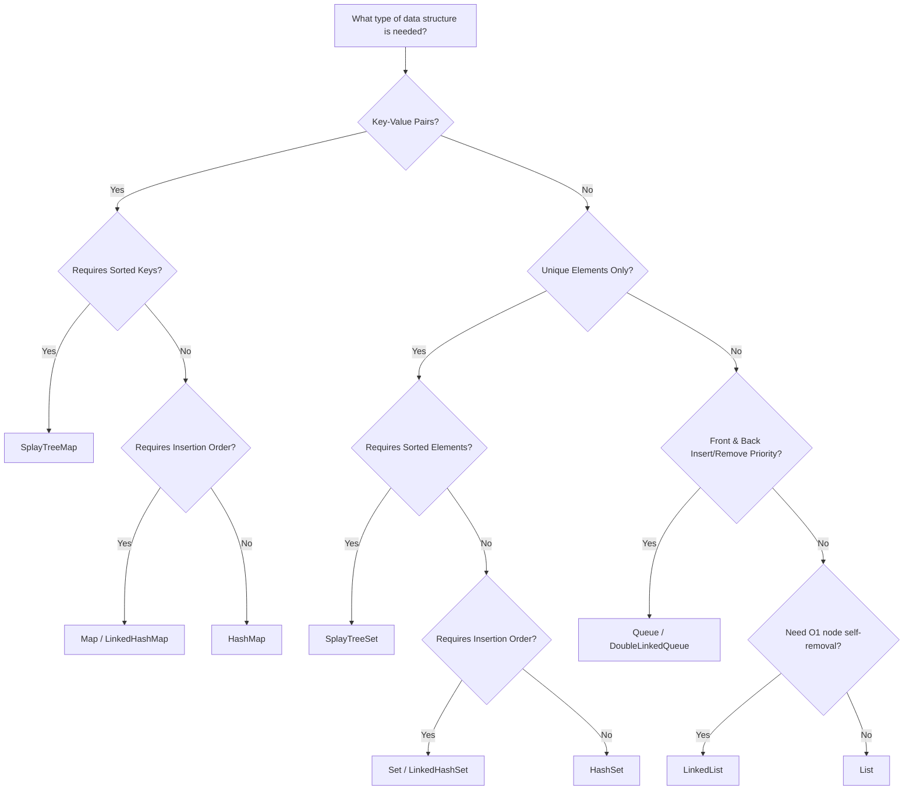

# Choosing the Right Collection

Choosing the wrong collection type can cause severe performance bottlenecks, subtle bugs, or bloated code. Use this architectural guide to choose the optimal collection type for any scenario.

---

## 1. Primary Decision Matrix

| Requirement | Best Choice | Secondary Option | Why? |
|---|---|---|---|
| Index-based lookup (`[i]`) | `List<E>` | — | Contiguous memory array with O(1) index access |
| Unique elements only | `Set<E>` (`LinkedHashSet`) | `HashSet<E>` | Guarantees uniqueness, O(1) lookup |
| Key-value lookup | `Map<K, V>` (`LinkedHashMap`) | `HashMap<K, V>` | Associate values with unique keys |
| FIFO Queue / LIFO Stack | `Queue<E>` | `DoubleLinkedQueue<E>` | O(1) push & pop at both ends without array re-allocation |
| Sorted elements at all times | `SplayTreeSet<E>` | `List<E>` (sort manually) | Self-adjusting BST; keeps items ordered dynamically |
| Sorted key-value map | `SplayTreeMap<K, V>` | — | Keys sorted automatically via comparator |
| O(1) middle insertions/removals with node reference | `LinkedList<E>` | `DoubleLinkedQueue<E>` | Direct node pointer manipulation |

---

## 2. Decision Tree Flowchart

---

## 3. Practical Comparison Cheat Sheet

### When to choose `List` over `Set`
- Order matters and elements may repeat (e.g., chat messages, order items).
- You frequently access items by numeric index (`list[0]`).

### When to choose `Set` over `List`
- You check membership often (`contains()`). On 10,000 items, `Set.contains()` takes ~0.001ms (O(1)), while `List.contains()` takes ~1ms (O(n)).
- You need mathematical set ops (`union`, `intersection`, `difference`).

### When to choose `Queue` over `List`
- You are removing from the front (`removeFirst()`).
- On a large `List`, `list.removeAt(0)` shifts every single element down (O(n)). `Queue.removeFirst()` is O(1).

---

## Summary Recommendation

> **Default Rule of Thumb:**
> - Need an ordered sequence? Use **`List`**.
> - Need key-value lookup? Use **`Map`** (default `{}`).
> - Need unique items? Use **`Set`** (default `{}`).
> - Reach for specialized collections in `dart:collection` (`Queue`, `HashMap`, `SplayTreeMap`, `LinkedList`) when performance requirements or sorted constraints demand them.

---

**Previous:** [Collection Equality](./equality)  
**Next:** [Performance & Complexity](./performance)  
**Related:** [Performance & Complexity](./performance) · [Collections Overview](./)
