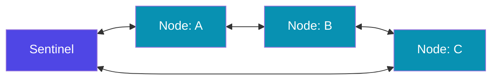

# `DoubleLinkedQueue<E>`

`DoubleLinkedQueue<E>` is a `Queue<E>` implementation backed by a **doubly-linked list** of nodes. Unlike the default `ListQueue` (circular buffer), it provides direct access to its `DoubleLinkedQueueEntry` nodes, enabling O(1) insertion and removal **at any position** when you hold a reference to the node.

---

## When to Use

✅ Use `DoubleLinkedQueue<E>` when you need to:
- O(1) insert/remove at **any** position using node references
- Implement complex data structures (LRU cache, ordered sets)
- Traverse both forward and backward efficiently
- Constantly reorder elements (e.g., priority reordering)

❌ Don't use `DoubleLinkedQueue<E>` when you need to:
- Simple FIFO → use `Queue<E>` (default `ListQueue` is faster for pure FIFO)
- Index-based access → use `List<E>`
- Unique elements → use `Set<E>`

---

## Memory Layout

Each element is stored in a `DoubleLinkedQueueEntry` node with pointers to the previous and next nodes, plus a sentinel head node:



- Each node: `element`, `previousEntry`, `nextEntry`
- Sentinel node marks the beginning/end of the list (circular structure internally)

---

## Import

```dart
import 'dart:collection';
```

---

## Constructors

### `DoubleLinkedQueue()` (default)

Creates an empty double-linked queue.

```dart
var dlq = DoubleLinkedQueue<int>();
```

### `DoubleLinkedQueue.of(Iterable<E> elements)`

Creates a queue from an iterable.

```dart
var dlq = DoubleLinkedQueue.of([1, 2, 3, 4, 5]);
print(dlq); // {1, 2, 3, 4, 5}
```

### `DoubleLinkedQueue.from(Iterable elements)`

Accepts `Iterable<dynamic>`.

```dart
var dlq = DoubleLinkedQueue<String>.from(['a', 'b', 'c']);
```

---

## Methods — Complete Reference

`DoubleLinkedQueue` inherits all `Queue<E>` methods and adds node-level access.

### Standard Queue Methods (Inherited)

#### `addFirst(E value)` — O(1)
#### `addLast(E value)` — O(1)
#### `add(E value)` — O(1), alias for `addLast`
#### `addAll(Iterable<E>)` — O(k)
#### `removeFirst()` — O(1)
#### `removeLast()` — O(1)
#### `remove(Object?)` — O(n)
#### `removeWhere(bool Function(E))` — O(n)
#### `retainWhere(bool Function(E))` — O(n)
#### `clear()` — O(n)
#### `contains(Object?)` — O(n)
#### `any(bool Function(E))` — O(n)
#### `every(bool Function(E))` — O(n)
#### `length`, `isEmpty`, `isNotEmpty`, `first`, `last`

See [Queue\<E\>](./queue) for detailed explanations of these methods.

---

### Node-Level Access

#### `firstEntry()` → `DoubleLinkedQueueEntry<E>?`

Returns the first node entry, or `null` if empty.

```dart
import 'dart:collection';

var dlq = DoubleLinkedQueue.of([10, 20, 30]);
var entry = dlq.firstEntry();
print(entry?.element); // 10
```

#### `lastEntry()` → `DoubleLinkedQueueEntry<E>?`

Returns the last node entry, or `null` if empty.

```dart
var entry = dlq.lastEntry();
print(entry?.element); // 30
```

#### `forEachEntry(void Function(DoubleLinkedQueueEntry<E>) action)`

Iterates over each node entry, giving direct access to node operations.

```dart
var dlq = DoubleLinkedQueue.of([1, 2, 3, 4, 5]);
dlq.forEachEntry((entry) {
  print('Element: ${entry.element}');
});
```

---

## `DoubleLinkedQueueEntry<E>` — Node API

Each node in a `DoubleLinkedQueue` is a `DoubleLinkedQueueEntry<E>` with the following members:

| Member | Description |
|--------|-------------|
| `E element` | The stored value (read/write) |
| `DoubleLinkedQueueEntry<E>? nextEntry()` | Next node in the queue |
| `DoubleLinkedQueueEntry<E>? previousEntry()` | Previous node in the queue |
| `void append(E value)` | Insert a new node **after** this node — O(1) |
| `void prepend(E value)` | Insert a new node **before** this node — O(1) |
| `E remove()` | Remove **this** node and return its element — O(1) |

### Node Traversal Example

```dart
import 'dart:collection';

var dlq = DoubleLinkedQueue.of([1, 2, 3, 4, 5]);

// Forward traversal
var entry = dlq.firstEntry();
while (entry != null) {
  print(entry.element);
  entry = entry.nextEntry();
}
// 1 2 3 4 5

// Backward traversal
entry = dlq.lastEntry();
while (entry != null) {
  print(entry.element);
  entry = entry.previousEntry();
}
// 5 4 3 2 1
```

### O(1) Insertion with Node Reference

```dart
import 'dart:collection';

var dlq = DoubleLinkedQueue.of([1, 3, 5]);

// Find the node containing '3'
var target = dlq.firstEntry();
while (target != null && target.element != 3) {
  target = target.nextEntry();
}

// Insert '2' before '3' — O(1)!
target?.prepend(2);

// Insert '4' after '3' — O(1)!
target?.append(4);

print(dlq); // {1, 2, 3, 4, 5}
```

---

## Performance & Complexity

| Operation | `DoubleLinkedQueue` | `ListQueue` (default) |
|-----------|-------------------|-----------------------|
| `addFirst()` | O(1) | O(1) amortized |
| `addLast()` | O(1) | O(1) amortized |
| `removeFirst()` | O(1) | O(1) |
| `removeLast()` | O(1) | O(1) |
| `remove(value)` | O(n) | O(n) |
| `node.append()` | O(1) | N/A |
| `node.prepend()` | O(1) | N/A |
| `node.remove()` | O(1) | N/A |
| Index access | O(n) | O(n) |
| Memory per element | Higher (node + 2 pointers) | Lower (array) |

:::note
For pure FIFO/LIFO without node access, the default `Queue()` (`ListQueue`) uses less memory and may be faster due to better cache locality. Use `DoubleLinkedQueue` specifically when you need node-level O(1) operations.
:::

---

## Real-World Examples

### Example 1: LRU Cache (Most Important Use Case)

An LRU (Least Recently Used) cache evicts the least recently accessed item when full. `DoubleLinkedQueue` gives O(1) move-to-front.

```dart
import 'dart:collection';

class LRUCache<K, V> {
  final int capacity;
  final Map<K, DoubleLinkedQueueEntry<MapEntry<K, V>>> _map = {};
  final DoubleLinkedQueue<MapEntry<K, V>> _queue = DoubleLinkedQueue();

  LRUCache(this.capacity);

  V? get(K key) {
    final entry = _map[key];
    if (entry == null) return null;

    // Move to end (most recently used)
    entry.remove();
    final newEntry = MapEntry(key, entry.element.value);
    _queue.addLast(newEntry);
    _map[key] = _queue.lastEntry()!;

    return entry.element.value;
  }

  void put(K key, V value) {
    if (_map.containsKey(key)) {
      _map[key]!.remove();
    } else if (_queue.length >= capacity) {
      final lru = _queue.removeFirst();
      _map.remove(lru.key);
    }
    _queue.addLast(MapEntry(key, value));
    _map[key] = _queue.lastEntry()!;
  }
}

void main() {
  var cache = LRUCache<int, String>(3);
  cache.put(1, 'one');
  cache.put(2, 'two');
  cache.put(3, 'three');
  cache.get(1);           // access 1 → moves to MRU
  cache.put(4, 'four');   // evicts 2 (LRU)
  print(cache.get(2));    // null (evicted)
  print(cache.get(1));    // one
  print(cache.get(4));    // four
}
```

### Example 2: Priority Queue (Manual)

```dart
import 'dart:collection';

class Task {
  final String name;
  final int priority;
  Task(this.name, this.priority);
  @override
  String toString() => '$name(p$priority)';
}

class ManualPriorityQueue {
  final DoubleLinkedQueue<Task> _queue = DoubleLinkedQueue();

  void insert(Task task) {
    var entry = _queue.firstEntry();
    while (entry != null && entry.element.priority >= task.priority) {
      entry = entry.nextEntry();
    }
    if (entry == null) {
      _queue.addLast(task);
    } else {
      entry.prepend(task);
    }
  }

  Task? poll() => _queue.isEmpty ? null : _queue.removeFirst();
}

void main() {
  var pq = ManualPriorityQueue();
  pq.insert(Task('Low priority', 1));
  pq.insert(Task('High priority', 10));
  pq.insert(Task('Medium priority', 5));

  while (true) {
    final t = pq.poll();
    if (t == null) break;
    print(t);
  }
  // High priority(p10)
  // Medium priority(p5)
  // Low priority(p1)
}
```

### Example 3: Deque-Based Sliding Window Maximum

```dart
import 'dart:collection';

// Find maximum in each sliding window of size k
List<int> slidingWindowMax(List<int> nums, int k) {
  final deque = DoubleLinkedQueue<int>(); // stores indices
  final result = <int>[];

  for (int i = 0; i < nums.length; i++) {
    // Remove elements outside window
    while (deque.isNotEmpty && deque.first < i - k + 1) {
      deque.removeFirst();
    }
    // Remove smaller elements from back
    while (deque.isNotEmpty && nums[deque.last] < nums[i]) {
      deque.removeLast();
    }
    deque.addLast(i);
    if (i >= k - 1) result.add(nums[deque.first]);
  }
  return result;
}

print(slidingWindowMax([1, 3, -1, -3, 5, 3, 6, 7], 3));
// [3, 3, 5, 5, 6, 7]
```

---

## Common Mistakes

### ❌ Using `DoubleLinkedQueue` when `Queue` suffices

```dart
// ❌ Unnecessary — DoubleLinkedQueue uses more memory
var dlq = DoubleLinkedQueue<int>();
dlq.addLast(1);
dlq.removeFirst(); // If you only need FIFO, use Queue

// ✅ Simpler and faster for pure FIFO
var q = Queue<int>();
```

### ❌ Using a node entry after removing it

```dart
var dlq = DoubleLinkedQueue.of([1, 2, 3]);
var entry = dlq.firstEntry()!;
entry.remove();
entry.nextEntry(); // ❌ undefined behavior — node detached!
```

### ❌ Modifying `element` and expecting automatic reordering

```dart
// DoubleLinkedQueue does NOT maintain sorted order
// Mutating the element doesn't move the node
var entry = dlq.firstEntry();
entry?.element = 999; // changes value in place, no reordering
```

---

## Best Practices

- **Use `DoubleLinkedQueue` only when you need node-level O(1) operations** like `append`, `prepend`, or `remove` via node reference.
- **Use the default `Queue()`** (which is `ListQueue`) for simple FIFO/LIFO patterns — it's faster and uses less memory.
- **Store `DoubleLinkedQueueEntry` references** in a `Map` alongside the queue for O(1) indexed access (as shown in the LRU cache example).
- **Don't access detached entries** — always check if the entry is still part of the queue.
