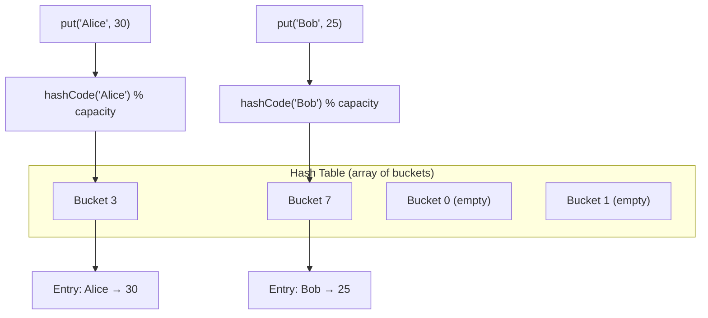

# `HashMap<K, V>`

`HashMap<K, V>` is a `Map` implementation backed by a **hash table** with **no guaranteed iteration order**. It offers the best average-case performance for lookup, insertion, and deletion, but sacrifices insertion-order iteration.

---

## When to Use

✅ Use `HashMap<K, V>` when you need:
- Maximum lookup/insert/delete performance
- Order of entries does **not** matter
- Storing large numbers of key-value pairs
- Building frequency maps, caches, or indexes where order is irrelevant

❌ Don't use `HashMap<K, V>` when you need:
- Predictable iteration order → use `LinkedHashMap` (default `{}`)
- Sorted keys → use `SplayTreeMap`
- Custom key equality without implementing `==` and `hashCode` → consider `LinkedHashMap` with custom equality

---

## Internal Implementation



- Keys are hashed using `hashCode`
- Hash collisions are resolved with **open addressing** or chaining (implementation detail)
- When the load factor exceeds a threshold, the table **rehashes** (resizes)

---

## Import

```dart
import 'dart:collection';
```

---

## Constructors

### `HashMap()`

Creates an empty HashMap using `==` and `hashCode` for key comparison.

```dart
import 'dart:collection';

var map = HashMap<String, int>();
map['Alice'] = 30;
map['Bob'] = 25;
print(map); // {Alice: 30, Bob: 25} (order not guaranteed)
```

### `HashMap({bool Function(K, K)? equals, int Function(K)? hashCode, bool Function(Object?)? isValidKey})`

Creates a HashMap with **custom equality and hash functions**. This is extremely useful for using non-standard key types or alternative equality semantics.

```dart
// Case-insensitive string keys
import 'dart:collection';

var map = HashMap<String, int>(
  equals: (a, b) => a.toLowerCase() == b.toLowerCase(),
  hashCode: (key) => key.toLowerCase().hashCode,
);

map['Alice'] = 30;
print(map['alice']); // 30 — case-insensitive lookup!
print(map['ALICE']); // 30
```

### `HashMap.identity()`

Keys are compared by **identity** (`identical()`), not by `==`. Useful when the same value object can appear as distinct keys.

```dart
var map = HashMap<List<int>, String>.identity();
var k1 = [1, 2, 3];
var k2 = [1, 2, 3];
map[k1] = 'first';
map[k2] = 'second'; // different object, treated as different key
print(map[k1]); // first
print(map[k2]); // second
print(map.length); // 2
```

### `HashMap.of(Map<K, V> other)`

Creates a new HashMap with the same entries.

```dart
var original = {'a': 1, 'b': 2};
var copy = HashMap.of(original);
```

### `HashMap.from(Map other)`

Like `HashMap.of` but accepts `Map<dynamic, dynamic>`. Less type-safe.

### `HashMap.fromEntries(Iterable<MapEntry<K, V>> entries)`

```dart
var map = HashMap.fromEntries([
  MapEntry('x', 10),
  MapEntry('y', 20),
]);
```

### `HashMap.fromIterables(Iterable<K> keys, Iterable<V> values)`

```dart
var map = HashMap.fromIterables(['a', 'b', 'c'], [1, 2, 3]);
```

---

## Methods

`HashMap` implements the full `Map<K, V>` interface. See [Map\<K,V\>](./map) for complete method documentation. Key methods:

| Method | Description | Complexity |
|--------|-------------|-----------|
| `[key]` | Lookup | O(1) avg |
| `[key] = val` | Insert/update | O(1) avg |
| `remove(key)` | Delete | O(1) avg |
| `containsKey(key)` | Key presence | O(1) avg |
| `containsValue(val)` | Value presence | O(n) |
| `forEach(f)` | Iterate | O(n) |
| `putIfAbsent(key, f)` | Insert if absent | O(1) avg |
| `update(key, f)` | Update entry | O(1) avg |
| `removeWhere(f)` | Bulk remove | O(n) |
| `map(f)` | Transform | O(n) |
| `.keys` / `.values` / `.entries` | Views | O(1) |

---

## Performance & Complexity

| Operation | Average | Worst Case | Notes |
|-----------|---------|-----------|-------|
| `[key]` read | O(1) | O(n) | Worst case: all keys collide |
| `[key]=` write | O(1) | O(n) | Amortized (rehashing occasionally) |
| `remove()` | O(1) | O(n) | |
| `containsKey()` | O(1) | O(n) | |
| `containsValue()` | O(n) | O(n) | Linear scan always |
| Iteration | O(n) | O(n) | Order not guaranteed |
| Rehashing | O(n) | O(n) | Triggered at load factor threshold |

---

## Custom Equality & hashCode

The most powerful feature of `HashMap`. Use it whenever your keys need non-standard comparison.

### Example: Using Lists as Keys

By default, `List` uses **identity** for `==` and `hashCode`. To use value equality as the key:

```dart
import 'dart:collection';

// Helper: hash a list by its contents
int listHash(List list) {
  var hash = 0;
  for (var e in list) hash = hash * 31 + e.hashCode;
  return hash;
}

var map = HashMap<List<int>, String>(
  equals: (a, b) {
    if (a.length != b.length) return false;
    for (var i = 0; i < a.length; i++) if (a[i] != b[i]) return false;
    return true;
  },
  hashCode: listHash,
);

map[[1, 2, 3]] = 'one-two-three';
print(map[[1, 2, 3]]); // one-two-three (different list object, same values!)
```

### Example: Record Keys

```dart
import 'dart:collection';

// (row, col) coordinate lookup
var grid = HashMap<(int, int), String>(
  equals: (a, b) => a.$1 == b.$1 && a.$2 == b.$2,
  hashCode: (k) => Object.hash(k.$1, k.$2),
);

grid[(0, 0)] = 'origin';
grid[(1, 2)] = 'somewhere';
print(grid[(0, 0)]); // origin
```

---

## Real-World Examples

### Example 1: Frequency Counter / Histogram

```dart
import 'dart:collection';

Map<String, int> buildFrequencyMap(List<String> words) {
  final freq = HashMap<String, int>();
  for (final word in words) {
    freq.update(word, (c) => c + 1, ifAbsent: () => 1);
  }
  return freq;
}

var words = 'the quick brown fox jumps over the lazy dog'.split(' ');
var freq = buildFrequencyMap(words);

// Top-5 most common words
var sorted = freq.entries.toList()
  ..sort((a, b) => b.value.compareTo(a.value));
sorted.take(5).forEach((e) => print('${e.key}: ${e.value}'));
```

### Example 2: Memoization

```dart
import 'dart:collection';

class Memoized<K, V> {
  final HashMap<K, V> _cache = HashMap();
  final V Function(K) _fn;

  Memoized(this._fn);

  V call(K key) => _cache.putIfAbsent(key, () => _fn(key));
}

// Memoized Fibonacci
final fib = Memoized<int, BigInt>((n) {
  if (n <= 1) return BigInt.from(n);
  // NOTE: this won't work recursively without self-reference
  // See the real recursive example below
  return BigInt.zero;
});

// Recursive memoized Fibonacci
final HashMap<int, BigInt> _fibCache = HashMap();
BigInt fibonacci(int n) {
  if (n <= 1) return BigInt.from(n);
  return _fibCache.putIfAbsent(n, () => fibonacci(n - 1) + fibonacci(n - 2));
}

print(fibonacci(100));
// 354224848179261915075
```

### Example 3: Graph Adjacency Map

```dart
import 'dart:collection';

class Graph {
  final HashMap<String, HashSet<String>> _adj = HashMap();

  void addEdge(String from, String to) {
    _adj.putIfAbsent(from, () => HashSet()).add(to);
    _adj.putIfAbsent(to, () => HashSet()).add(from); // undirected
  }

  Set<String> neighbors(String node) => _adj[node] ?? {};

  int get nodeCount => _adj.length;

  int get edgeCount =>
      _adj.values.fold(0, (sum, s) => sum + s.length) ~/ 2;
}

void main() {
  var g = Graph();
  g.addEdge('A', 'B');
  g.addEdge('A', 'C');
  g.addEdge('B', 'C');
  g.addEdge('C', 'D');

  print('Neighbors of A: ${g.neighbors('A')}'); // {B, C}
  print('Nodes: ${g.nodeCount}, Edges: ${g.edgeCount}'); // 4, 4
}
```

### Example 4: Symbol Table (Compiler/Interpreter)

```dart
import 'dart:collection';

enum SymbolKind { variable, function, constant }

class Symbol {
  final String name;
  final SymbolKind kind;
  final dynamic value;
  Symbol(this.name, this.kind, [this.value]);
}

class SymbolTable {
  final HashMap<String, Symbol> _table = HashMap();
  final SymbolTable? _parent; // for lexical scoping

  SymbolTable([this._parent]);

  void define(Symbol symbol) => _table[symbol.name] = symbol;

  Symbol? lookup(String name) =>
      _table[name] ?? _parent?.lookup(name);

  bool isDefined(String name) => lookup(name) != null;
}
```

---

## Common Mistakes

### ❌ Expecting insertion order

```dart
import 'dart:collection';

var map = HashMap<String, int>();
map['b'] = 2;
map['a'] = 1;
map['c'] = 3;

// ❌ Don't assume any order
for (var key in map.keys) print(key); // may print b, a, c or any other order

// ✅ Sort explicitly if you need order
map.keys.toList()..sort()..forEach(print); // a, b, c
```

### ❌ Using mutable objects as keys without custom equality

```dart
// ❌ List uses identity for hashCode by default
var map = HashMap<List<int>, String>();
var key = [1, 2, 3];
map[key] = 'value';
print(map[[1, 2, 3]]); // null — different list object!

// ✅ Use custom hashCode + equals
var map = HashMap<List<int>, String>(
  equals: (a, b) => const ListEquality().equals(a, b),
  hashCode: (k) => const ListEquality().hash(k),
);
```

### ❌ Implementing `hashCode` inconsistently with `==`

The contract: if `a == b`, then `a.hashCode == b.hashCode`.

```dart
// ❌ BROKEN: objects that are equal don't have the same hash
class BadKey {
  int value;
  BadKey(this.value);
  @override bool operator ==(Object other) => other is BadKey && value == other.value;
  // Missing hashCode override! Uses identity hashCode — broken!
}

// ✅ Always override hashCode when you override ==
class GoodKey {
  final int value;
  GoodKey(this.value);
  @override bool operator ==(Object other) => other is GoodKey && value == other.value;
  @override int get hashCode => value.hashCode;
}
```

---

## Best Practices

- **Override both `==` and `hashCode`** whenever using custom objects as keys.
- **Use `HashMap` over the default `Map`** only when you have measured a performance need — the default `LinkedHashMap` is fast enough for most cases.
- **Use `HashMap` with custom `equals`/`hashCode`** for flexible key types (case-insensitive strings, records, etc.).
- **Avoid using mutable objects as keys** — if the key mutates after insertion, the hash changes and the entry becomes unreachable.
- **Use `HashMap.identity()`** when you deliberately want reference equality for keys.

---

**Previous:** [LinkedList\<E\>](./linked-list)  
**Next:** [LinkedHashMap\<K,V\>](./linked-hashmap)  
**Related:** [Map\<K,V\>](./map) · [LinkedHashMap\<K,V\>](./linked-hashmap) · [SplayTreeMap\<K,V\>](./splay-tree-map)
