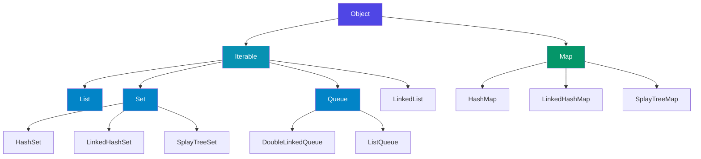
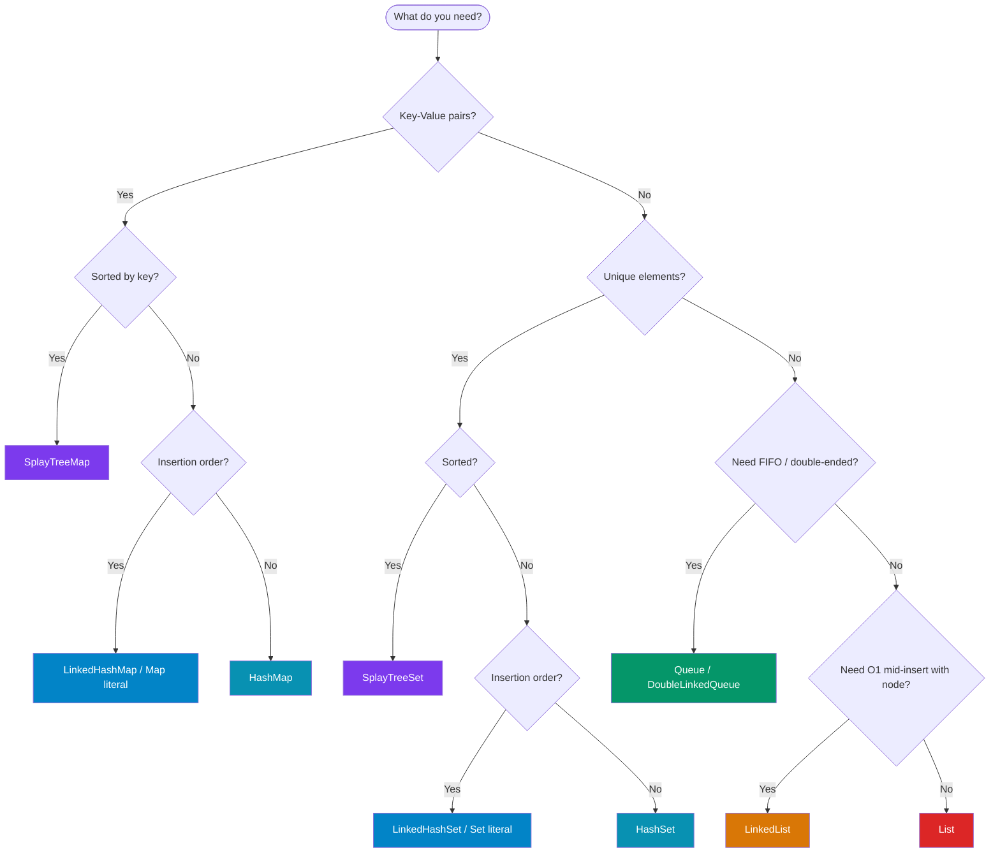

# Dart Collections

Collections are one of the most fundamental parts of every Dart program. Whether you are building a Flutter UI, writing a CLI tool, or processing data from an API, you will use collections constantly.

This section covers **every** collection type in the Dart core library and the `dart:collection` package — with complete method references, diagrams, real-world examples, and performance analysis.

---

## What Is a Collection?

A **collection** is an object that groups multiple elements into a single unit. Collections let you store, retrieve, manipulate, and iterate over groups of values.

In Dart, all standard collections implement the `Iterable<E>` interface (except `Map`, which has a separate hierarchy). This means they share a rich set of common methods like `map()`, `where()`, `fold()`, `any()`, and `every()`.

```dart
// Every collection can be iterated
List<int> list = [1, 2, 3];
Set<int> set   = {1, 2, 3};
// Map is iterated via .entries, .keys, or .values
Map<String, int> map = {'a': 1, 'b': 2};

for (var x in list) print(x);
for (var x in set)  print(x);
for (var e in map.entries) print('${e.key}: ${e.value}');
```

---

## Collection Hierarchy



:::note
`Map<K, V>` does **not** implement `Iterable`. It has its own separate hierarchy but provides `Iterable` views via `.keys`, `.values`, and `.entries`.
:::

---

## The Two Roots: `Iterable` vs `Map`

| Feature | `Iterable<E>` | `Map<K, V>` |
|---------|--------------|------------|
| Element type | Single type `E` | Key `K` + Value `V` |
| Iteration | `for (var x in collection)` | `for (var e in map.entries)` |
| Access | By index or order | By key |
| Common subtypes | `List`, `Set`, `Queue`, `LinkedList` | `HashMap`, `LinkedHashMap`, `SplayTreeMap` |
| Shared methods | `map()`, `where()`, `fold()`, `any()`, `every()` | `map()`, `forEach()`, `putIfAbsent()` |

---

## Collection Categories

### 1. Sequences (Ordered, Indexed)

Collections where elements have a defined position and can be accessed by index.

| Type | Notes |
|------|-------|
| `List<E>` | The most common. Growable or fixed-length. |
| `Queue<E>` | Efficient add/remove at both ends (FIFO/LIFO). |
| `DoubleLinkedQueue<E>` | Queue backed by a doubly-linked list. |
| `LinkedList<E>` | Doubly-linked list with direct node access. |

### 2. Sets (Unique Elements)

Collections that guarantee no duplicate elements.

| Type | Ordered? | Notes |
|------|----------|-------|
| `Set<E>` | No (default: `LinkedHashSet`) | General-purpose unique collection. |
| `HashSet<E>` | No | Fastest lookup; no order guarantee. |
| `LinkedHashSet<E>` | Insertion order | Default `Set` literal implementation. |
| `SplayTreeSet<E>` | Sorted | Self-balancing BST; always sorted. |

### 3. Maps (Key-Value Pairs)

Collections of key-value associations where each key is unique.

| Type | Ordered? | Notes |
|------|----------|-------|
| `Map<K, V>` | Depends | Abstract; default is `LinkedHashMap`. |
| `HashMap<K, V>` | No | Fastest lookup; no order. |
| `LinkedHashMap<K, V>` | Insertion order | Default `{}` literal. |
| `SplayTreeMap<K, V>` | Sorted by key | Always sorted; good for range queries. |

---

## Complete Comparison Table

| Collection | Ordered | Unique | Key/Value | Sorted | Growable | Import | Typical Use |
|-----------|---------|--------|-----------|--------|----------|--------|-------------|
| `List<E>` | ✅ | ❌ | ❌ | ❌ | ✅ | core | Ordered items, indexable, most common |
| `Set<E>` | ⚠️ (insertion) | ✅ | ❌ | ❌ | ✅ | core | Unique items, fast membership test |
| `Map<K,V>` | ⚠️ (insertion) | Keys ✅ | ✅ | ❌ | ✅ | core | Key-value pairs, lookups |
| `Queue<E>` | ✅ | ❌ | ❌ | ❌ | ✅ | dart:collection | FIFO/LIFO operations |
| `DoubleLinkedQueue<E>` | ✅ | ❌ | ❌ | ❌ | ✅ | dart:collection | Efficient double-ended queue |
| `LinkedList<E>` | ✅ | ❌ | ❌ | ❌ | ✅ | dart:collection | O(1) insert/remove with node refs |
| `HashMap<K,V>` | ❌ | Keys ✅ | ✅ | ❌ | ✅ | dart:collection | Fastest map lookups |
| `LinkedHashMap<K,V>` | ✅ (insertion) | Keys ✅ | ✅ | ❌ | ✅ | dart:collection | Default Map literal |
| `SplayTreeMap<K,V>` | ✅ (sorted) | Keys ✅ | ✅ | ✅ | ✅ | dart:collection | Sorted keys, range queries |
| `HashSet<E>` | ❌ | ✅ | ❌ | ❌ | ✅ | dart:collection | Fastest set operations |
| `LinkedHashSet<E>` | ✅ (insertion) | ✅ | ❌ | ❌ | ✅ | dart:collection | Default Set literal |
| `SplayTreeSet<E>` | ✅ (sorted) | ✅ | ❌ | ✅ | ✅ | dart:collection | Sorted unique elements |

:::tip
When in doubt, start with `List`, `Set`, or `Map`. Reach for specialised types only when you have a concrete reason (ordering, sorting, performance).
:::

---

## Collection Packages

### `dart:core` (built-in — always available)

```dart
// No import needed
List<String> names = ['Alice', 'Bob'];
Set<int>     ids   = {1, 2, 3};
Map<String, int> scores = {'Alice': 95};
```

Includes: `List`, `Set`, `Map`, `Iterable`, `Iterator`

### `dart:collection`

```dart
import 'dart:collection';

Queue<int>              queue = Queue();
DoubleLinkedQueue<int>  dlq   = DoubleLinkedQueue();
LinkedList<MyEntry>     ll    = LinkedList();
HashMap<String, int>    hm    = HashMap();
LinkedHashMap<String, int> lhm = LinkedHashMap();
SplayTreeMap<String, int> stm  = SplayTreeMap();
HashSet<int>            hs    = HashSet();
LinkedHashSet<int>      lhs   = LinkedHashSet();
SplayTreeSet<int>       sts   = SplayTreeSet();
```

### `package:collection` (pub.dev)

Extends the standard library with powerful utilities.

```yaml
# pubspec.yaml
dependencies:
  collection: ^1.18.0
```

```dart
import 'package:collection/collection.dart';

// Equality helpers
final eq = ListEquality();
eq.equals([1, 2, 3], [1, 2, 3]); // true

// groupBy
final grouped = groupBy([1, 2, 3, 4], (n) => n.isEven ? 'even' : 'odd');
// {odd: [1, 3], even: [2, 4]}

// PriorityQueue
final pq = PriorityQueue<int>((a, b) => a.compareTo(b));
pq.add(5); pq.add(1); pq.add(3);
print(pq.removeFirst()); // 1
```

---

## Choosing at a Glance



---

## Key Concepts

### Lazy vs Eager Evaluation

Most `Iterable` methods (like `map()`, `where()`, `expand()`) return **lazy iterables** — no computation happens until you consume the result.

```dart
var lazy = [1, 2, 3, 4, 5]
    .where((n) => n.isOdd)   // no work yet
    .map((n) => n * 10);     // no work yet

// Work happens HERE:
for (var n in lazy) print(n); // 10, 30, 50

// Or force it to a concrete collection:
var list = lazy.toList(); // [10, 30, 50]
var set  = lazy.toSet();  // {10, 30, 50}
```

### Mutability

| Term | Meaning |
|------|---------|
| `const` collection | Compile-time constant; deeply immutable |
| `final` collection | Variable cannot be reassigned; contents can still change |
| `List.unmodifiable()` | Runtime-immutable wrapper; throws on mutation |
| Growable `List` | Default; elements can be added/removed |
| Fixed-length `List` | `List.filled(n, val)`; length cannot change |

---

## Quick Syntax Reference

```dart
// List literal
var list = [1, 2, 3];
List<int> typed = <int>[1, 2, 3];

// Set literal
var set = {1, 2, 3};
Set<int> typedSet = <int>{1, 2, 3};
var empty = <int>{};        // ← NOT {} which is an empty Map!

// Map literal
var map = {'key': 'value'};
Map<String, int> ages = {'Alice': 30, 'Bob': 25};
var emptyMap = <String, int>{};

// Collection if / for / spread
var extended = [
  ...list,
  if (true) 4,
  for (var i = 5; i <= 6; i++) i,
];
// [1, 2, 3, 4, 5, 6]
```

---

## Section Navigation

Explore every collection type in depth:

| Page | Description |
|------|-------------|
| [Iterable\<E\>](./iterable) | The foundation of all collections |
| [List\<E\>](./list) | Ordered, indexable, most common |
| [Set\<E\>](./set) | Unique elements |
| [Map\<K,V\>](./map) | Key-value pairs |
| [Queue\<E\>](./queue) | FIFO/LIFO queue |
| [DoubleLinkedQueue\<E\>](./double-linked-queue) | Doubly-linked queue |
| [LinkedList\<E\>](./linked-list) | Node-based linked list |
| [HashMap\<K,V\>](./hashmap) | Unordered, fastest map |
| [LinkedHashMap\<K,V\>](./linked-hashmap) | Insertion-ordered map |
| [SplayTreeMap\<K,V\>](./splay-tree-map) | Sorted map |
| [HashSet\<E\>](./hashset) | Unordered, fastest set |
| [LinkedHashSet\<E\>](./linked-hashset) | Insertion-ordered set |
| [SplayTreeSet\<E\>](./splay-tree-set) | Sorted set |
| [Unmodifiable Collections](./unmodifiable) | Immutability in Dart |
| [Collection Literals](./literals) | `[]`, `{}`, spread, if, for |
| [Collection Operators](./operators) | Spread, cascade, null-aware |
| [Collection Utilities](./utilities) | Iterable methods, generators |
| [Collection Equality](./equality) | DeepCollectionEquality and more |
| [Choosing the Right Collection](./choosing) | Decision guide |
| [Performance & Complexity](./performance) | Big-O reference |
| [Common Patterns](./patterns) | Grouping, sorting, chunking… |
| [Common Mistakes](./mistakes) | Pitfalls to avoid |
| [Best Practices](./best-practices) | Professional recommendations |
