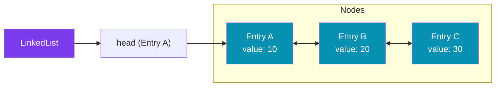

# `LinkedList<E extends LinkedListEntry<E>>`

`LinkedList<E>` is a **doubly-linked list** in `dart:collection` where each element is a node (`LinkedListEntry<E>`) that knows its neighbours. Unlike `DoubleLinkedQueue`, the list itself doesn't wrap elements — your **class** must extend `LinkedListEntry<E>`, making elements self-aware of their position.

---

## When to Use

✅ Use `LinkedList<E>` when you need:
- O(1) insertion/removal anywhere using a node reference
- Elements that can remove themselves from the list (self-removal)
- Building complex linked data structures
- Implementing adjacency lists, token streams, or custom allocators

❌ Don't use `LinkedList<E>` when you need:
- Simple sequences → use `List<E>` or `Queue<E>`
- Elements that don't extend `LinkedListEntry` (restriction)
- Index-based access
- Elements belonging to multiple lists simultaneously

---

## Memory Layout



Each `LinkedListEntry<E>` contains:
- `E? _next` — pointer to next entry
- `E? _previous` — pointer to previous entry
- `LinkedList<E>? _list` — the list it belongs to

---

## Import

```dart
import 'dart:collection';
```

---

## Defining a `LinkedListEntry`

**Your class must extend `LinkedListEntry<YourClass>`** — this is the key difference from `Queue` or `List`.

```dart
import 'dart:collection';

// Define your entry type
class NumberEntry extends LinkedListEntry<NumberEntry> {
  int value;
  NumberEntry(this.value);

  @override
  String toString() => 'NumberEntry($value)';
}

// Use it
var list = LinkedList<NumberEntry>();
list.add(NumberEntry(10));
list.add(NumberEntry(20));
list.add(NumberEntry(30));

for (var entry in list) {
  print(entry.value); // 10, 20, 30
}
```

---

## Constructors

### `LinkedList()` (default)

Creates an empty linked list.

```dart
var list = LinkedList<NumberEntry>();
```

---

## Key Properties

| Property | Type | Description |
|----------|------|-------------|
| `length` | `int` | Number of entries |
| `isEmpty` | `bool` | True if no entries |
| `isNotEmpty` | `bool` | True if at least one entry |
| `first` | `E` | First entry; throws if empty |
| `last` | `E` | Last entry; throws if empty |
| `single` | `E` | Only entry; throws if 0 or 2+ |
| `iterator` | `Iterator<E>` | For `for-in` |

---

## Methods — Complete Reference

### Adding Elements

#### `add(E entry)` — Adds to the end — O(1)

```dart
var list = LinkedList<NumberEntry>();
list.add(NumberEntry(1));
list.add(NumberEntry(2));
list.add(NumberEntry(3));
// list: 1 ↔ 2 ↔ 3
```

#### `addFirst(E entry)` — Adds to the front — O(1)

```dart
list.addFirst(NumberEntry(0));
// list: 0 ↔ 1 ↔ 2 ↔ 3
```

#### `addAll(Iterable<E> entries)` — Adds all to end — O(k)

```dart
list.addAll([NumberEntry(4), NumberEntry(5)]);
// list: 0 ↔ 1 ↔ 2 ↔ 3 ↔ 4 ↔ 5
```

---

### Removing Elements

#### `remove(E entry)` — O(1)

Removes a specific entry from the list. The `entry` is invalidated after removal.

```dart
var list = LinkedList<NumberEntry>();
var entry2 = NumberEntry(2);
list.addAll([NumberEntry(1), entry2, NumberEntry(3)]);

list.remove(entry2);
print(list.map((e) => e.value).toList()); // [1, 3]
```

#### `clear()` — O(n)

Removes all entries.

```dart
list.clear();
print(list.isEmpty); // true
```

---

### `LinkedListEntry<E>` Node Methods

Each entry has node-level methods for O(1) positioning:

#### `entry.insertBefore(E newEntry)` — O(1)

Inserts `newEntry` directly before this entry in the list.

```dart
var list = LinkedList<NumberEntry>();
var e1 = NumberEntry(1);
var e3 = NumberEntry(3);
list.addAll([e1, e3]);

// Insert 2 between 1 and 3
e3.insertBefore(NumberEntry(2));
print(list.map((e) => e.value).toList()); // [1, 2, 3]
```

#### `entry.insertAfter(E newEntry)` — O(1)

Inserts `newEntry` directly after this entry.

```dart
var list = LinkedList<NumberEntry>();
var e1 = NumberEntry(1);
var e3 = NumberEntry(3);
list.addAll([e1, e3]);

// Insert 2 after 1
e1.insertAfter(NumberEntry(2));
print(list.map((e) => e.value).toList()); // [1, 2, 3]
```

#### `entry.unlink()` — O(1)

Removes this entry from its list. Self-removal.

```dart
var list = LinkedList<NumberEntry>();
var target = NumberEntry(2);
list.addAll([NumberEntry(1), target, NumberEntry(3)]);

target.unlink(); // removes itself
print(list.map((e) => e.value).toList()); // [1, 3]
```

#### `entry.next` → `E?`

The next entry in the list, or `null` if this is the last entry.

```dart
var first = list.first;
print(first.next?.value); // value of second entry
```

#### `entry.previous` → `E?`

The previous entry in the list, or `null` if this is the first entry.

```dart
var last = list.last;
print(last.previous?.value); // value of second-to-last
```

#### `entry.list` → `LinkedList<E>?`

The list this entry belongs to, or `null` if unlinked.

```dart
print(target.list != null); // true if in a list
```

---

### Searching & Iteration

#### Searching by value

`LinkedList` has no direct search method. Iterate manually or use `where()`.

```dart
// Find entry with value 3
NumberEntry? found;
for (var e in list) {
  if (e.value == 3) { found = e; break; }
}

// Or using Iterable methods (lazy)
found = list.firstWhere((e) => e.value == 3, orElse: null);
```

#### Bidirectional traversal

```dart
// Forward
var current = list.first;
while (current != null) {
  print(current.value);
  current = current.next;
}

// Backward
var current = list.last;
while (current != null) {
  print(current.value);
  current = current.previous;
}
```

---

## Performance & Complexity

| Operation | `LinkedList<E>` | `List<E>` | `Queue<E>` |
|-----------|----------------|---------|----------|
| Add to front | O(1) | O(n) | O(1) |
| Add to back | O(1) | O(1) | O(1) |
| Insert (with node ref) | O(1) | O(n) | O(n) |
| Remove (with node ref) | O(1) | O(n) | O(n) |
| Self-removal (`unlink`) | O(1) | O(n) | O(n) |
| Index access | O(n) | O(1) | O(n) |
| `length` | O(1) | O(1) | O(1) |
| Memory per element | Higher (node + 2 ptrs) | Lower (array) | Higher (node) |

---

## Real-World Examples

### Example 1: Token / Lexer Stream

```dart
import 'dart:collection';

enum TokenType { identifier, number, operator, keyword }

class Token extends LinkedListEntry<Token> {
  final TokenType type;
  final String value;
  Token(this.type, this.value);

  @override
  String toString() => '[$type: $value]';
}

class TokenStream {
  final LinkedList<Token> _tokens = LinkedList();

  void add(Token token) => _tokens.add(token);

  // Remove all whitespace tokens (O(n) scan but O(1) per removal)
  void removeOfType(TokenType type) {
    var current = _tokens.isEmpty ? null : _tokens.first;
    while (current != null) {
      final next = current.next; // save before potential removal
      if (current.type == type) current.unlink();
      current = next;
    }
  }

  // Insert a token after a specific position
  void insertAfter(Token anchor, Token newToken) {
    anchor.insertAfter(newToken);
  }
}
```

### Example 2: Order Book (Trading System)

```dart
import 'dart:collection';

class Order extends LinkedListEntry<Order> {
  final String id;
  final double price;
  final int quantity;
  final bool isBuy;

  Order({
    required this.id,
    required this.price,
    required this.quantity,
    required this.isBuy,
  });

  void cancel() => unlink(); // O(1) self-removal
}

class OrderBook {
  final LinkedList<Order> _bids = LinkedList(); // buy orders
  final LinkedList<Order> _asks = LinkedList(); // sell orders
  final Map<String, Order> _orderIndex = {};

  void submit(Order order) {
    final book = order.isBuy ? _bids : _asks;
    book.add(order);
    _orderIndex[order.id] = order;
  }

  bool cancel(String orderId) {
    final order = _orderIndex.remove(orderId);
    if (order == null) return false;
    order.cancel(); // O(1)
    return true;
  }
}
```

### Example 3: Middleware Pipeline

```dart
import 'dart:collection';

typedef Middleware = Map<String, dynamic> Function(
    Map<String, dynamic> context,
    Map<String, dynamic> Function() next);

class MiddlewareEntry extends LinkedListEntry<MiddlewareEntry> {
  final Middleware middleware;
  MiddlewareEntry(this.middleware);
}

class Pipeline {
  final LinkedList<MiddlewareEntry> _middlewares = LinkedList();

  void use(Middleware m) => _middlewares.add(MiddlewareEntry(m));

  void useFirst(Middleware m) => _middlewares.addFirst(MiddlewareEntry(m));

  Map<String, dynamic> execute(Map<String, dynamic> context) {
    var current = _middlewares.isEmpty ? null : _middlewares.first;

    Map<String, dynamic> next() {
      if (current == null) return context;
      final entry = current!;
      current = entry.next;
      return entry.middleware(context, next);
    }

    return next();
  }
}
```

---

## Common Mistakes

### ❌ Forgetting to extend `LinkedListEntry`

```dart
// ❌ Won't compile — String doesn't extend LinkedListEntry
var list = LinkedList<String>();

// ✅ Must define a wrapper class
class StringEntry extends LinkedListEntry<StringEntry> {
  final String value;
  StringEntry(this.value);
}
var list = LinkedList<StringEntry>();
```

### ❌ Using an entry after `unlink()`

```dart
var entry = list.first;
entry.unlink();
entry.next;    // ❌ entry is detached — next is null (or undefined)
entry.unlink(); // ❌ throws — already unlinked
```

### ❌ Adding the same entry to two lists

```dart
var list1 = LinkedList<NumberEntry>();
var list2 = LinkedList<NumberEntry>();
var entry = NumberEntry(42);

list1.add(entry);
list2.add(entry); // ❌ StateError — entry already in a list
```

### ❌ Modifying the list while iterating with `for-in`

```dart
// ❌ ConcurrentModificationError
for (var entry in list) {
  if (entry.value == 2) list.remove(entry);
}

// ✅ Collect entries to remove first, or use unlink while saving next
var current = list.isEmpty ? null : list.first;
while (current != null) {
  final next = current.next;
  if (current.value == 2) current.unlink();
  current = next;
}
```

---

## Best Practices

- **Extend `LinkedListEntry` only when you genuinely need O(1) mid-list operations** — the boilerplate is not worth it for simple lists.
- **Always save `current.next` before calling `unlink()`** during manual iteration.
- **Use a `Map<K, Entry>` index** alongside a `LinkedList` when you need O(1) lookup by key AND O(1) insertion/removal — this is the classic LRU cache pattern.
- **Prefer `Queue` or `List`** for most use cases — `LinkedList` is a specialized tool.

---

## Comparison with Similar Collections

| Feature | `LinkedList<E>` | `DoubleLinkedQueue<E>` | `List<E>` |
|---------|----------------|----------------------|---------|
| Mid-insert (node ref) | O(1) | O(1) | O(n) |
| Self-removal | O(1) `unlink()` | O(1) `entry.remove()` | O(n) |
| Element restriction | Must extend `LinkedListEntry` | No restriction | No restriction |
| Index access | O(n) | O(n) | O(1) |
| Import | dart:collection | dart:collection | core |
