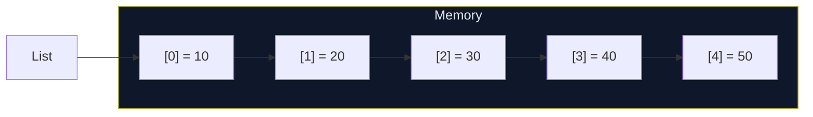

# `List<E>`

`List<E>` is Dart's most commonly used collection. It is an **ordered**, **indexable** sequence of elements where elements can be accessed in O(1) by their integer index. Most Dart programs use `List` heavily — from Flutter widget lists to storing API results.

---

## When to Use

✅ Use `List<E>` when you need to:
- Maintain insertion order and access elements by position
- Allow duplicate elements
- Use index-based access (`list[i]`)
- Iterate in a defined order
- Use as a Flutter widget source (`ListView.builder`, `GridView`)

❌ Don't use `List<E>` when you need to:
- Guarantee uniqueness → use `Set<E>`
- Fast key-based lookup → use `Map<K,V>`
- Frequent insertions/deletions at the front → use `Queue<E>`
- O(1) middle insertion/deletion with node references → use `LinkedList<E>`

---

## Memory Layout

A `List<E>` in Dart is backed by a **contiguous block of memory** (like an array). When the list grows beyond its current capacity, Dart allocates a larger buffer and copies the elements.



```
Index:   0    1    2    3    4
Value:  10   20   30   40   50
        ↑                    ↑
      first                last
```

---

## Syntax

```dart
// Type inferred
var list = [1, 2, 3];

// Explicit type
List<int> nums = [1, 2, 3];

// Type annotation on the right
var names = <String>['Alice', 'Bob', 'Carol'];

// Empty list
var empty = <int>[];
List<String> emptyNames = [];
```

---

## Constructors

### `List.empty({bool growable = false})`

Creates an empty list. By default creates a **fixed-length** empty list (cannot add elements). Pass `growable: true` for a growable empty list.

```dart
var fixed    = List<int>.empty();            // fixed-length, empty
var growable = List<int>.empty(growable: true); // same as <int>[]
```

:::note
`List.empty()` without `growable: true` is a fixed-length list — you cannot call `add()` on it. For a growable empty list, prefer `<int>[]` or `List.empty(growable: true)`.
:::

### `List.filled(int length, E fill, {bool growable = false})`

Creates a list of a given length, with every position filled with the same value.

```dart
var zeros    = List<int>.filled(5, 0);          // [0, 0, 0, 0, 0]
var booleans = List<bool>.filled(3, false);     // [false, false, false]
var growable = List<int>.filled(3, 0, growable: true); // can add more

zeros[2] = 42;
print(zeros); // [0, 0, 42, 0, 0]
```

:::warning
**Do not use `List.filled(n, [])` for a list of lists!** All positions will share the **same** list reference.
```dart
// ❌ WRONG: all rows share the same list!
var bad = List.filled(3, <int>[]);
bad[0].add(1);
print(bad); // [[1], [1], [1]] — not what you want!

// ✅ CORRECT: use List.generate instead
var good = List.generate(3, (_) => <int>[]);
good[0].add(1);
print(good); // [[1], [], []]
```
:::

### `List.generate(int length, E Function(int index) generator, {bool growable = true})`

Creates a list by calling a generator function for each index. The most flexible constructor.

```dart
var squares = List.generate(6, (i) => i * i);
// [0, 1, 4, 9, 16, 25]

var chars = List.generate(5, (i) => String.fromCharCode(65 + i));
// [A, B, C, D, E]

// 2D grid (3×3)
var grid = List.generate(3, (row) =>
    List.generate(3, (col) => row * 3 + col));
// [[0,1,2], [3,4,5], [6,7,8]]
```

### `List.of(Iterable<E> elements, {bool growable = true})`

Creates a new list with the same elements as the given iterable. **Preferred over `List.from`** because it is type-safe.

```dart
Set<int> sourceSet = {3, 1, 4, 1, 5};
List<int> fromSet = List.of(sourceSet);
print(fromSet); // [3, 1, 4, 5]  (order may vary)

// From another list
var copy = List.of([1, 2, 3]);
copy.add(4);
print(copy); // [1, 2, 3, 4]
```

### `List.from(Iterable elements, {bool growable = true})`

Like `List.of` but accepts `Iterable<dynamic>`. Use when the source type differs.

```dart
var dynamic_ = <dynamic>[1, 'hello', true];
var list = List<Object>.from(dynamic_);
```

:::tip
Prefer `List.of()` over `List.from()` when the type matches — it preserves type safety at compile time.
:::

### `List.unmodifiable(Iterable<E> elements)`

Creates a **runtime-immutable** list. Any mutation attempt throws an `UnsupportedError`.

```dart
var source = [1, 2, 3];
var immutable = List.unmodifiable(source);

immutable[0];          // ✅ reading is fine — returns 1
immutable.add(4);      // ❌ throws UnsupportedError
immutable[0] = 99;     // ❌ throws UnsupportedError

// Modifying the source does NOT affect the immutable copy
source.add(4);
print(immutable); // [1, 2, 3] — unchanged
```

---

## Key Properties

| Property | Type | Description |
|----------|------|-------------|
| `length` | `int` | Number of elements |
| `isEmpty` | `bool` | True if length == 0 |
| `isNotEmpty` | `bool` | True if length > 0 |
| `first` | `E` | First element (throws if empty) |
| `last` | `E` | Last element (throws if empty) |
| `single` | `E` | Only element; throws if 0 or 2+ |
| `reversed` | `Iterable<E>` | Lazy reversed view |
| `iterator` | `Iterator<E>` | Iterator for `for-in` |

---

## Methods — Complete Reference

### Adding Elements

#### `add(E element)`

Appends an element to the end. Amortized O(1).

```dart
var list = <int>[1, 2, 3];
list.add(4);
print(list); // [1, 2, 3, 4]
```

#### `addAll(Iterable<E> iterable)`

Appends all elements from an iterable to the end.

```dart
var list = [1, 2, 3];
list.addAll([4, 5, 6]);
print(list); // [1, 2, 3, 4, 5, 6]

list.addAll({7, 8}); // from a Set
print(list); // [1, 2, 3, 4, 5, 6, 7, 8]
```

#### `insert(int index, E element)`

Inserts an element at the given index. O(n) — shifts subsequent elements right.

```dart
var list = ['a', 'b', 'd'];
list.insert(2, 'c');
print(list); // [a, b, c, d]
```

#### `insertAll(int index, Iterable<E> iterable)`

Inserts all elements at the given index.

```dart
var list = [1, 5];
list.insertAll(1, [2, 3, 4]);
print(list); // [1, 2, 3, 4, 5]
```

---

### Removing Elements

#### `remove(Object? value)` → `bool`

Removes the **first** occurrence of `value`. Returns `true` if found.

```dart
var list = [1, 2, 3, 2, 1];
list.remove(2);
print(list); // [1, 3, 2, 1]  (only first 2 removed)
```

#### `removeAt(int index)` → `E`

Removes the element at the given index and returns it. O(n).

```dart
var list = ['a', 'b', 'c', 'd'];
var removed = list.removeAt(1);
print(removed); // b
print(list);    // [a, c, d]
```

#### `removeLast()` → `E`

Removes and returns the last element. O(1).

```dart
var list = [1, 2, 3];
print(list.removeLast()); // 3
print(list);              // [1, 2]
```

#### `removeWhere(bool Function(E) test)`

Removes all elements matching the predicate. Iterates the entire list.

```dart
var nums = [1, 2, 3, 4, 5, 6];
nums.removeWhere((n) => n.isEven);
print(nums); // [1, 3, 5]

var words = ['apple', 'fig', 'banana', 'kiwi'];
words.removeWhere((w) => w.length > 4);
print(words); // [fig, kiwi]
```

#### `retainWhere(bool Function(E) test)`

Removes all elements that do **NOT** match the predicate (keeps matching ones).

```dart
var nums = [1, 2, 3, 4, 5];
nums.retainWhere((n) => n.isOdd);
print(nums); // [1, 3, 5]
```

#### `clear()`

Removes all elements. O(n).

```dart
var list = [1, 2, 3];
list.clear();
print(list); // []
```

---

### Accessing & Searching

#### `operator [](int index)` → `E`

Returns the element at index. O(1). Throws `RangeError` if out of bounds.

```dart
var list = [10, 20, 30];
print(list[0]); // 10
print(list[2]); // 30
```

#### `indexOf(E element, [int start = 0])` → `int`

Returns the first index of `element` at or after `start`. Returns `-1` if not found.

```dart
var list = [1, 2, 3, 2, 1];
print(list.indexOf(2));     // 1
print(list.indexOf(2, 2));  // 3  (search from index 2)
print(list.indexOf(9));     // -1
```

#### `lastIndexOf(E element, [int? start])` → `int`

Returns the last index of `element` at or before `start`.

```dart
var list = [1, 2, 3, 2, 1];
print(list.lastIndexOf(2)); // 3
```

#### `indexWhere(bool Function(E) test, [int start = 0])` → `int`

Returns the index of the first element matching the test.

```dart
var list = [5, 15, 25, 35];
print(list.indexWhere((n) => n > 20)); // 2 (index of 25)
```

#### `lastIndexWhere(bool Function(E) test, [int? start])` → `int`

Returns the index of the last element matching the test.

```dart
var list = [5, 15, 25, 35];
print(list.lastIndexWhere((n) => n < 30)); // 2 (index of 25)
```

#### `contains(Object? element)` → `bool`

Linear scan for element equality. O(n). For repeated lookups, consider a `Set`.

```dart
var list = [1, 2, 3];
print(list.contains(2)); // true
print(list.contains(9)); // false
```

---

### Modifying In Place

#### `operator []=(int index, E value)`

Replaces the element at index. O(1).

```dart
var list = [1, 2, 3];
list[1] = 99;
print(list); // [1, 99, 3]
```

#### `sort([int Function(E a, E b)? compare])`

Sorts the list **in place**. Uses the `Comparable` natural order by default, or a custom comparator. O(n log n).

```dart
var nums = [3, 1, 4, 1, 5, 9, 2, 6];
nums.sort();
print(nums); // [1, 1, 2, 3, 4, 5, 6, 9]

// Descending
nums.sort((a, b) => b.compareTo(a));
print(nums); // [9, 6, 5, 4, 3, 2, 1, 1]

// Custom: sort by string length, then alphabetically
var words = ['banana', 'fig', 'apple', 'kiwi'];
words.sort((a, b) {
  final lenCmp = a.length.compareTo(b.length);
  return lenCmp != 0 ? lenCmp : a.compareTo(b);
});
print(words); // [fig, kiwi, apple, banana]
```

#### `shuffle([Random? random])`

Randomly shuffles the list in place.

```dart
var list = [1, 2, 3, 4, 5];
list.shuffle();
print(list); // e.g. [3, 1, 5, 2, 4]

// With a seeded random for reproducibility
import 'dart:math';
list.shuffle(Random(42));
```

#### `fillRange(int start, int end, [E? fill])`

Fills a range of the list with the given value.

```dart
var list = [1, 2, 3, 4, 5];
list.fillRange(1, 4, 0);
print(list); // [1, 0, 0, 0, 5]
```

#### `setRange(int start, int end, Iterable<E> iterable, [int skipCount = 0])`

Overwrites a range of positions with values from an iterable.

```dart
var list = [1, 2, 3, 4, 5];
list.setRange(1, 3, [20, 30]);
print(list); // [1, 20, 30, 4, 5]
```

#### `replaceRange(int start, int end, Iterable<E> replacement)`

Removes the range `[start, end)` and inserts the replacement elements.

```dart
var list = [1, 2, 3, 4, 5];
list.replaceRange(1, 3, [20, 30, 99]);
print(list); // [1, 20, 30, 99, 4, 5]
```

#### `setAll(int index, Iterable<E> iterable)`

Overwrites elements starting at index with values from iterable.

```dart
var list = [1, 2, 3, 4, 5];
list.setAll(2, [30, 40]);
print(list); // [1, 2, 30, 40, 5]
```

---

### Slicing & Views

#### `sublist(int start, [int? end])` → `List<E>`

Returns a new list containing elements from `start` to `end` (exclusive). **Creates a copy.**

```dart
var list = [1, 2, 3, 4, 5];
print(list.sublist(1, 4)); // [2, 3, 4]
print(list.sublist(3));    // [4, 5]
```

#### `getRange(int start, int end)` → `Iterable<E>`

Returns a **lazy view** over a range. Unlike `sublist`, does not create a copy.

```dart
var list = [1, 2, 3, 4, 5];
var view = list.getRange(1, 4);
print(view.toList()); // [2, 3, 4]
```

#### `asMap()` → `Map<int, E>`

Returns an unmodifiable Map view where keys are indices.

```dart
var list = ['a', 'b', 'c'];
print(list.asMap()); // {0: a, 1: b, 2: c}
```

---

### Transformation

#### `map<T>(T Function(E) f)` → `Iterable<T>`

See [Iterable.map](./iterable#methods).

```dart
var nums = [1, 2, 3];
print(nums.map((n) => n * 10).toList()); // [10, 20, 30]
```

#### `where(bool Function(E) test)` → `Iterable<E>`

```dart
var nums = [1, 2, 3, 4, 5];
print(nums.where((n) => n > 3).toList()); // [4, 5]
```

#### `expand<T>(Iterable<T> Function(E) f)` → `Iterable<T>`

```dart
var list = [1, 2, 3];
var expanded = list.expand((n) => [n, n * 10]);
print(expanded.toList()); // [1, 10, 2, 20, 3, 30]
```

#### `reduce(E Function(E, E) combine)` → `E`

```dart
var list = [1, 2, 3, 4, 5];
print(list.reduce((a, b) => a + b)); // 15
```

#### `fold<T>(T initialValue, T Function(T, E) combine)` → `T`

```dart
var list = [1, 2, 3, 4, 5];
var sum = list.fold<int>(0, (acc, n) => acc + n);
print(sum); // 15
```

#### `join([String separator = ''])` → `String`

```dart
print([1, 2, 3].join(' + ')); // 1 + 2 + 3
print(['a', 'b', 'c'].join()); // abc
```

#### `reversed` → `Iterable<E>`

Returns a lazy reversed view. Does not modify the list.

```dart
var list = [1, 2, 3, 4, 5];
print(list.reversed.toList()); // [5, 4, 3, 2, 1]
// Original list unchanged
```

#### `toSet()` → `Set<E>`

Converts to a Set, removing duplicates.

```dart
print([1, 2, 2, 3, 3, 3].toSet()); // {1, 2, 3}
```

---

### Testing

#### `any(bool Function(E) test)` → `bool`

```dart
print([1, 2, 3].any((n) => n > 2)); // true
```

#### `every(bool Function(E) test)` → `bool`

```dart
print([2, 4, 6].every((n) => n.isEven)); // true
```

---

## Performance & Complexity

| Operation | Complexity | Notes |
|-----------|-----------|-------|
| `list[i]` (read/write) | O(1) | Direct memory access |
| `add()` | O(1) amortized | May trigger reallocation |
| `addAll()` | O(k) | k = number of new elements |
| `insert(i)` | O(n) | Shifts elements right |
| `removeAt(i)` | O(n) | Shifts elements left |
| `removeLast()` | O(1) | No shifting |
| `contains()` | O(n) | Linear scan |
| `indexOf()` | O(n) | Linear scan |
| `sort()` | O(n log n) | Timsort |
| `sublist()` | O(k) | Copies k elements |
| `length` | O(1) | Stored field |
| `first` / `last` | O(1) | Direct access |

---

## Real-World Examples

### Example 1: Shopping Cart

```dart
class CartItem {
  final String name;
  final double price;
  int quantity;
  CartItem(this.name, this.price, this.quantity);
}

class ShoppingCart {
  final List<CartItem> _items = [];

  void addItem(CartItem item) => _items.add(item);

  void removeItem(String name) =>
      _items.removeWhere((item) => item.name == name);

  double get total =>
      _items.fold(0, (sum, item) => sum + item.price * item.quantity);

  List<CartItem> get sortedByPrice =>
      [..._items]..sort((a, b) => b.price.compareTo(a.price));
}

void main() {
  var cart = ShoppingCart();
  cart.addItem(CartItem('Apple', 1.50, 3));
  cart.addItem(CartItem('Bread', 2.99, 1));
  cart.addItem(CartItem('Milk', 3.49, 2));

  print('Total: \$${cart.total.toStringAsFixed(2)}'); // Total: $13.45

  for (var item in cart.sortedByPrice) {
    print('${item.name}: \$${item.price}');
  }
  // Milk: $3.49
  // Bread: $2.99
  // Apple: $1.50
}
```

### Example 2: Task Manager

```dart
enum Priority { low, medium, high }

class Task {
  final String title;
  final Priority priority;
  bool completed;
  Task(this.title, this.priority, {this.completed = false});
}

class TaskManager {
  final List<Task> tasks = [];

  void add(Task task) => tasks.add(task);

  List<Task> get pending => tasks.where((t) => !t.completed).toList();

  List<Task> get highPriority =>
      tasks.where((t) => t.priority == Priority.high && !t.completed).toList();

  void completeAll() => tasks.forEach((t) => t.completed = true);

  List<Task> get sortedByPriority =>
      [...tasks]..sort((a, b) => b.priority.index.compareTo(a.priority.index));
}
```

### Example 3: Music Playlist

```dart
class Song {
  final String title;
  final String artist;
  final Duration duration;
  Song(this.title, this.artist, this.duration);
}

class Playlist {
  final List<Song> _songs = [];
  int _currentIndex = 0;

  void add(Song song) => _songs.add(song);
  void remove(Song song) => _songs.remove(song);
  void shuffle() => _songs.shuffle();

  Song? get current => _songs.isEmpty ? null : _songs[_currentIndex];
  Song? get next    => _currentIndex < _songs.length - 1
      ? _songs[++_currentIndex] : null;
  Song? get previous => _currentIndex > 0
      ? _songs[--_currentIndex] : null;

  Duration get totalDuration =>
      _songs.fold(Duration.zero, (sum, s) => sum + s.duration);
}
```

---

## Flutter Examples

### `ListView.builder` from a List

```dart
class TodoScreen extends StatelessWidget {
  final List<String> todos;
  const TodoScreen({required this.todos, super.key});

  @override
  Widget build(BuildContext context) {
    return ListView.builder(
      itemCount: todos.length,
      itemBuilder: (context, index) => ListTile(
        leading: CircleAvatar(child: Text('${index + 1}')),
        title: Text(todos[index]),
        trailing: const Icon(Icons.check_circle_outline),
      ),
    );
  }
}
```

### Dynamic Chip List

```dart
class FilterChips extends StatefulWidget {
  const FilterChips({super.key});

  @override
  State<FilterChips> createState() => _FilterChipsState();
}

class _FilterChipsState extends State<FilterChips> {
  final List<String> _tags = ['Flutter', 'Dart', 'Firebase', 'Riverpod'];
  final List<String> _selected = [];

  @override
  Widget build(BuildContext context) {
    return Wrap(
      spacing: 8,
      children: _tags.map((tag) => FilterChip(
        label: Text(tag),
        selected: _selected.contains(tag),
        onSelected: (sel) => setState(() =>
            sel ? _selected.add(tag) : _selected.remove(tag)),
      )).toList(),
    );
  }
}
```

### GridView from List

```dart
GridView.builder(
  gridDelegate: const SliverGridDelegateWithFixedCrossAxisCount(
    crossAxisCount: 2,
    childAspectRatio: 3 / 2,
  ),
  itemCount: products.length,
  itemBuilder: (context, index) => ProductCard(product: products[index]),
)
```

---

## Collection Literals with `if` and `for`

```dart
bool isLoggedIn = true;
List<String> menuItems = [
  'Home',
  'Explore',
  if (isLoggedIn) 'Profile',
  if (isLoggedIn) 'Logout' else 'Login',
];
// ['Home', 'Explore', 'Profile', 'Logout']

// collection-for: flatten multiple sources
var allTags = [
  for (var post in posts) ...post.tags,
];
```

---

## Common Mistakes

### ❌ Modifying a list while iterating

```dart
var list = [1, 2, 3, 4, 5];

// ❌ WRONG — throws ConcurrentModificationError
for (var item in list) {
  if (item.isEven) list.remove(item);
}

// ✅ CORRECT — iterate a copy, or use removeWhere
list.removeWhere((item) => item.isEven);
```

### ❌ Sharing mutable default list values

```dart
// ❌ WRONG — every call gets the same list reference
class Config {
  List<String> tags;
  Config({this.tags = const []});
}

// ✅ CORRECT — use const or copy
Config({List<String>? tags}) : tags = tags ?? [];
```

### ❌ Comparing lists with `==`

```dart
var a = [1, 2, 3];
var b = [1, 2, 3];
print(a == b); // false — different object references!

// ✅ Use package:collection
import 'package:collection/collection.dart';
print(const ListEquality().equals(a, b)); // true
```

### ❌ Using `List.filled` for mutable sub-lists

```dart
// ❌ All rows share the same List instance!
var grid = List.filled(3, <int>[]);

// ✅ Use List.generate
var grid = List.generate(3, (_) => <int>[]);
```

### ❌ Calling `first` on an empty list

```dart
List<int> empty = [];
empty.first; // ❌ StateError

// ✅ Check first
if (empty.isNotEmpty) print(empty.first);
```

---

## Best Practices

- **Prefer `final` for list variables** that won't be reassigned: `final items = <String>[];`
- **Use `const` for immutable literals**: `const colors = ['red', 'green', 'blue'];`
- **Prefer `removeWhere`** over iterating and removing manually.
- **Use `List.generate`** instead of `List.filled` for complex initialization.
- **Use spread `...`** for combining lists: `[...a, ...b]` instead of `a..addAll(b)`.
- **Prefer `List.of()`** over `List.from()` for type-safe copies.
- **Store the result of lazy chains**: call `.toList()` once and reuse.
- **Use `Set.contains()` for large membership checks** — `List.contains()` is O(n).

---

## Comparison with Similar Collections

| Feature | `List<E>` | `Set<E>` | `Queue<E>` | `LinkedList<E>` |
|---------|----------|---------|----------|----------------|
| Ordered | ✅ | ❌ | ✅ | ✅ |
| Indexed access | ✅ O(1) | ❌ | ❌ | ❌ |
| Duplicates | ✅ | ❌ | ✅ | ✅ |
| Add at front | O(n) | — | O(1) | O(1) |
| Add at end | O(1) | — | O(1) | O(1) |
| Remove from middle | O(n) | O(1) | O(n) | O(1) with node |
| Memory | Contiguous | Hash table | Linked | Linked nodes |

---

## Summary

- `List<E>` is an ordered, indexable sequence backed by a contiguous array.
- Default growable lists expand automatically; fixed-length lists have a set size.
- All constructors serve different use cases: `filled`, `generate`, `of`, `unmodifiable`.
- O(1) for indexed access and `add()`; O(n) for insert/remove in the middle.
- Combine with `map()`, `where()`, `sort()`, and spread for powerful data pipelines.

---

**Previous:** [Iterable\<E\>](./iterable)  
**Next:** [Set\<E\>](./set)  
**Related:** [Collection Literals](./literals) · [Common Patterns](./patterns) · [Performance & Complexity](./performance)
