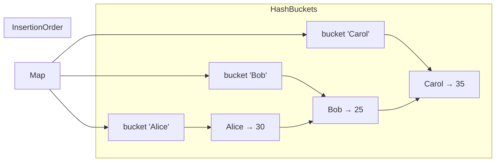

# `Map<K, V>`

`Map<K, V>` is Dart's built-in key-value collection. Each **key** is unique and maps to exactly one **value**. The default `Map` literal creates a `LinkedHashMap`, which preserves insertion order.

---

## When to Use

✅ Use `Map<K, V>` when you need to:
- Associate keys with values (lookup by key)
- Fast O(1) access by a specific identifier (string, int, enum, etc.)
- Represent structured data (like JSON)
- Build configuration, registries, caches, or lookup tables

❌ Don't use `Map<K, V>` when you need to:
- An ordered sequence of single values → use `List<E>`
- Unique elements only → use `Set<E>`
- Sorted keys → use `SplayTreeMap<K, V>`
- No specific key type → consider a typed class or record

---

## Memory Layout (LinkedHashMap — default)



---

## Syntax

```dart
// Map literal (creates LinkedHashMap)
var ages = {'Alice': 30, 'Bob': 25, 'Carol': 35};

// Typed
Map<String, int> scores = {'Math': 95, 'Science': 88};

// Explicit type on right
var config = <String, dynamic>{'host': 'localhost', 'port': 8080};

// Empty map
var empty = <String, int>{};
Map<String, String> headers = {};
```

---

## Constructors

### `Map()` (factory)

Creates an empty `LinkedHashMap`. Same as `{}`.

```dart
var m = Map<String, int>();
// same as:
var m2 = <String, int>{};
```

### `Map.from(Map other)`

Creates a new `LinkedHashMap` with the same entries. **Not type-safe** — prefer `Map.of()`.

```dart
Map<dynamic, dynamic> source = {'a': 1, 'b': 2};
var copy = Map<String, int>.from(source);
```

### `Map.of(Map<K, V> other)`

Type-safe copy of a map. Creates a new `LinkedHashMap`.

```dart
var original = {'a': 1, 'b': 2};
var copy = Map.of(original);
copy['c'] = 3;
print(original); // {a: 1, b: 2}
print(copy);     // {a: 1, b: 2, c: 3}
```

### `Map.unmodifiable(Map<K, V> other)`

Creates an unmodifiable view. Any mutation throws `UnsupportedError`.

```dart
var config = Map.unmodifiable({'host': 'localhost', 'port': 8080});
config['host'] = 'example.com'; // ❌ UnsupportedError
```

### `Map.identity()`

Uses `identical()` for key comparison instead of `==`.

```dart
var m = Map<List<int>, String>.identity();
var key1 = [1, 2, 3];
var key2 = [1, 2, 3];
m[key1] = 'first';
print(m[key2]); // null — different object, even though equal values
print(m[key1]); // first — same object
```

### `Map.fromEntries(Iterable<MapEntry<K,V>> entries)`

Creates a map from an iterable of `MapEntry` objects.

```dart
var entries = [
  MapEntry('Alice', 30),
  MapEntry('Bob', 25),
  MapEntry('Carol', 35),
];
var ages = Map.fromEntries(entries);
print(ages); // {Alice: 30, Bob: 25, Carol: 35}

// Powerful when transforming another collection
var list = ['Alice', 'Bob', 'Carol'];
var nameIndex = Map.fromEntries(
  list.asMap().entries.map((e) => MapEntry(e.value, e.key)),
);
print(nameIndex); // {Alice: 0, Bob: 1, Carol: 2}
```

### `Map.fromIterables(Iterable<K> keys, Iterable<V> values)`

Creates a map from two separate iterables of keys and values.

```dart
var keys   = ['a', 'b', 'c'];
var values = [1, 2, 3];
var map    = Map.fromIterables(keys, values);
print(map); // {a: 1, b: 2, c: 3}

// Great for "zipping" two lists
var students = ['Alice', 'Bob', 'Carol'];
var grades   = [92, 78, 88];
var gradebook = Map.fromIterables(students, grades);
```

---

## Key Properties

| Property | Type | Description |
|----------|------|-------------|
| `length` | `int` | Number of key-value pairs |
| `isEmpty` | `bool` | True if no entries |
| `isNotEmpty` | `bool` | True if at least one entry |
| `keys` | `Iterable<K>` | All keys |
| `values` | `Iterable<V>` | All values |
| `entries` | `Iterable<MapEntry<K,V>>` | All key-value pairs |

---

## Methods — Complete Reference

### Accessing Values

#### `operator [](Object? key)` → `V?`

Returns the value for the key, or `null` if not found. **Never throws** for missing keys.

```dart
var ages = {'Alice': 30, 'Bob': 25};
print(ages['Alice']);   // 30
print(ages['Unknown']); // null — no error!
```

#### `operator []=(K key, V value)`

Sets or updates the value for the key.

```dart
var ages = {'Alice': 30};
ages['Alice'] = 31;  // update
ages['Bob'] = 25;    // insert
print(ages); // {Alice: 31, Bob: 25}
```

---

### Adding & Updating

#### `putIfAbsent(K key, V Function() ifAbsent)` → `V`

Returns the value for `key`, inserting `ifAbsent()` if the key is missing.

```dart
var cache = <String, List<int>>{};

// Safely access or create
cache.putIfAbsent('evens', () => []).add(2);
cache.putIfAbsent('evens', () => []).add(4); // key exists, doesn't overwrite

print(cache); // {evens: [2, 4]}

// Classic group-by pattern
var words = ['apple', 'ant', 'banana', 'blueberry'];
var grouped = <String, List<String>>{};
for (var word in words) {
  grouped.putIfAbsent(word[0], () => []).add(word);
}
print(grouped); // {a: [apple, ant], b: [banana, blueberry]}
```

#### `update(K key, V Function(V) update, {V Function()? ifAbsent})` → `V`

Updates the value for `key`. Throws if key is missing and `ifAbsent` is not provided.

```dart
var scores = {'Alice': 90, 'Bob': 85};

// Update existing
scores.update('Alice', (v) => v + 5);
print(scores['Alice']); // 95

// Update or insert
scores.update('Dave', (v) => v + 5, ifAbsent: () => 80);
print(scores['Dave']); // 80
```

#### `updateAll(V Function(K, V) update)`

Updates every entry using the provided function.

```dart
var prices = {'apple': 1.00, 'banana': 0.50, 'cherry': 2.00};
// Apply 10% discount
prices.updateAll((key, value) => value * 0.90);
print(prices); // {apple: 0.9, banana: 0.45, cherry: 1.8}
```

#### `addAll(Map<K, V> other)`

Adds all entries from `other`. Overwrites existing keys.

```dart
var m = {'a': 1, 'b': 2};
m.addAll({'b': 99, 'c': 3});
print(m); // {a: 1, b: 99, c: 3}
```

#### `addEntries(Iterable<MapEntry<K,V>> entries)`

Adds all entries from an iterable of `MapEntry` objects.

```dart
var m = {'a': 1};
m.addEntries([MapEntry('b', 2), MapEntry('c', 3)]);
print(m); // {a: 1, b: 2, c: 3}
```

---

### Removing Entries

#### `remove(Object? key)` → `V?`

Removes and returns the value for `key`. Returns `null` if not found.

```dart
var m = {'a': 1, 'b': 2, 'c': 3};
var removed = m.remove('b');
print(removed); // 2
print(m);       // {a: 1, c: 3}
```

#### `removeWhere(bool Function(K, V) test)`

Removes all entries matching the predicate.

```dart
var scores = {'Alice': 90, 'Bob': 45, 'Carol': 78, 'Dave': 30};
scores.removeWhere((key, value) => value < 50);
print(scores); // {Alice: 90, Carol: 78}
```

#### `clear()`

Removes all entries.

```dart
var m = {'a': 1, 'b': 2};
m.clear();
print(m); // {}
```

---

### Testing & Searching

#### `containsKey(Object? key)` → `bool`

Returns true if the key exists. O(1) average.

```dart
var m = {'a': 1, 'b': 2};
print(m.containsKey('a')); // true
print(m.containsKey('z')); // false
```

#### `containsValue(Object? value)` → `bool`

Returns true if any value equals `value`. **O(n) — linear scan.**

```dart
var m = {'a': 1, 'b': 2};
print(m.containsValue(2)); // true
```

---

### Iteration & Transformation

#### `forEach(void Function(K, V) action)`

Calls `action` for every entry.

```dart
var ages = {'Alice': 30, 'Bob': 25};
ages.forEach((name, age) => print('$name is $age years old'));
// Alice is 30 years old
// Bob is 25 years old
```

#### `map<K2, V2>(MapEntry<K2, V2> Function(K, V) f)` → `Map<K2, V2>`

Transforms every entry and returns a new map.

```dart
var ages = {'Alice': 30, 'Bob': 25};

// Double all ages
var doubled = ages.map((k, v) => MapEntry(k, v * 2));
print(doubled); // {Alice: 60, Bob: 50}

// Swap keys and values
var inverted = ages.map((k, v) => MapEntry(v, k));
print(inverted); // {30: Alice, 25: Bob}
```

#### `.entries` → `Iterable<MapEntry<K, V>>`

Iterates over `MapEntry` objects containing `.key` and `.value`.

```dart
var scores = {'Alice': 90, 'Bob': 85, 'Carol': 92};

// Find highest scorer
var top = scores.entries.reduce((a, b) => a.value >= b.value ? a : b);
print('Top: ${top.key} (${top.value})'); // Top: Carol (92)

// Convert to list of strings
var lines = scores.entries
    .map((e) => '${e.key}: ${e.value}')
    .toList();
```

#### `.keys` → `Iterable<K>`

```dart
var m = {'a': 1, 'b': 2, 'c': 3};
print(m.keys.toList());   // [a, b, c]
print(m.keys.first);      // a
```

#### `.values` → `Iterable<V>`

```dart
var m = {'a': 1, 'b': 2, 'c': 3};
print(m.values.toList()); // [1, 2, 3]
var total = m.values.fold(0, (a, b) => a + b);
print(total); // 6
```

---

## Nested Maps & JSON-like Structures

```dart
// JSON-style nested map
Map<String, dynamic> user = {
  'id': 42,
  'name': 'Alice',
  'email': 'alice@example.com',
  'address': {
    'street': '123 Main St',
    'city': 'Dartville',
    'country': 'BD',
  },
  'roles': ['admin', 'editor'],
  'preferences': {
    'theme': 'dark',
    'notifications': true,
  },
};

// Access nested values
print(user['name']);  // Alice
print((user['address'] as Map)['city']); // Dartville
print((user['roles'] as List)[0]);       // admin

// Type-safe deep access helper
T? deepGet<T>(Map<String, dynamic> map, List<String> keys) {
  dynamic current = map;
  for (final key in keys) {
    if (current is Map) {
      current = current[key];
    } else {
      return null;
    }
  }
  return current as T?;
}

print(deepGet<String>(user, ['address', 'city'])); // Dartville
print(deepGet<bool>(user, ['preferences', 'notifications'])); // true
```

---

## Performance & Complexity

| Operation | `Map` (LinkedHashMap) | `HashMap` | `SplayTreeMap` |
|-----------|----------------------|---------|---------------|
| `[]` (read) | O(1) avg | O(1) avg | O(log n) |
| `[]=` (write) | O(1) avg | O(1) avg | O(log n) |
| `remove()` | O(1) avg | O(1) avg | O(log n) |
| `containsKey()` | O(1) avg | O(1) avg | O(log n) |
| `containsValue()` | O(n) | O(n) | O(n) |
| Iteration | O(n) | O(n) | O(n) |
| Order | Insertion | None | Sorted |

---

## Real-World Examples

### Example 1: Cache System

```dart
class SimpleCache<K, V> {
  final int maxSize;
  final Map<K, V> _cache;

  SimpleCache({this.maxSize = 100})
      : _cache = LinkedHashMap();

  V? get(K key) => _cache[key];

  void put(K key, V value) {
    if (_cache.containsKey(key)) {
      _cache.remove(key); // Move to end (LRU)
    } else if (_cache.length >= maxSize) {
      _cache.remove(_cache.keys.first); // Evict oldest
    }
    _cache[key] = value;
  }

  void invalidate(K key) => _cache.remove(key);
  void clear() => _cache.clear();
}

import 'dart:collection';
void main() {
  var cache = SimpleCache<String, String>(maxSize: 3);
  cache.put('a', 'Apple');
  cache.put('b', 'Banana');
  cache.put('c', 'Cherry');
  cache.put('d', 'Date'); // Evicts 'a'
  print(cache.get('a')); // null (evicted)
  print(cache.get('b')); // Banana
}
```

### Example 2: Word Frequency Counter

```dart
Map<String, int> wordFrequency(String text) {
  final freq = <String, int>{};
  for (final word in text.toLowerCase().split(RegExp(r'\W+'))) {
    if (word.isEmpty) continue;
    freq.update(word, (c) => c + 1, ifAbsent: () => 1);
  }
  return freq;
}

var freq = wordFrequency('the cat sat on the mat and the cat');
var sorted = freq.entries.toList()
  ..sort((a, b) => b.value.compareTo(a.value));

for (var e in sorted.take(5)) {
  print('${e.key}: ${e.value}');
}
// the: 3
// cat: 2
// sat: 1
// on: 1
// mat: 1
```

### Example 3: Student Grade Book

```dart
class GradeBook {
  final Map<String, List<int>> _records = {};

  void addGrade(String student, int grade) =>
      _records.putIfAbsent(student, () => []).add(grade);

  double average(String student) {
    final grades = _records[student];
    if (grades == null || grades.isEmpty) return 0;
    return grades.reduce((a, b) => a + b) / grades.length;
  }

  Map<String, double> get averages =>
      Map.fromEntries(_records.keys.map(
        (s) => MapEntry(s, average(s)),
      ));

  String get topStudent =>
      averages.entries.reduce((a, b) => a.value > b.value ? a : b).key;
}
```

### Example 4: Router / Registry Pattern

```dart
typedef Handler = void Function(Map<String, String> params);

class Router {
  final Map<String, Handler> _routes = {};

  void register(String path, Handler handler) {
    _routes[path] = handler;
  }

  void handle(String path, [Map<String, String> params = const {}]) {
    final handler = _routes[path];
    if (handler != null) {
      handler(params);
    } else {
      print('404: No handler for $path');
    }
  }
}

void main() {
  var router = Router();
  router.register('/home', (_) => print('Home page'));
  router.register('/user', (p) => print('User: ${p['id']}'));

  router.handle('/home');              // Home page
  router.handle('/user', {'id': '42'}); // User: 42
}
```

---

## Flutter Examples

### `DropdownButton` from Map

```dart
Map<String, String> countryDialCodes = {
  'Bangladesh': '+880',
  'India': '+91',
  'USA': '+1',
  'UK': '+44',
};

class DialCodeDropdown extends StatefulWidget {
  const DialCodeDropdown({super.key});

  @override
  State<DialCodeDropdown> createState() => _DialCodeDropdownState();
}

class _DialCodeDropdownState extends State<DialCodeDropdown> {
  String _selected = 'Bangladesh';

  @override
  Widget build(BuildContext context) {
    return DropdownButton<String>(
      value: _selected,
      items: countryDialCodes.keys.map((country) => DropdownMenuItem(
        value: country,
        child: Text('$country (${countryDialCodes[country]})'),
      )).toList(),
      onChanged: (val) => setState(() => _selected = val!),
    );
  }
}
```

### JSON Decoding to Map

```dart
import 'dart:convert';

Future<void> loadUser() async {
  const jsonStr = '{"id": 1, "name": "Alice", "email": "alice@test.com"}';
  final Map<String, dynamic> user = jsonDecode(jsonStr);

  print(user['name']);  // Alice
  print(user['email']); // alice@test.com
}
```

---

## Common Mistakes

### ❌ Checking `map['key'] != null` vs `containsKey`

```dart
var m = {'a': null}; // null is a valid value!

// ❌ This wrongly treats null values as missing
if (m['a'] != null) { ... } // skips 'a' even though key exists

// ✅ Use containsKey for presence check
if (m.containsKey('a')) { ... }
```

### ❌ Modifying a map while iterating

```dart
var m = {'a': 1, 'b': 2, 'c': 3};

// ❌ Throws ConcurrentModificationError
for (var key in m.keys) {
  if (m[key]! < 2) m.remove(key);
}

// ✅ Use removeWhere
m.removeWhere((key, value) => value < 2);
```

### ❌ Using mutable objects as map keys

```dart
var m = <List<int>, String>{};
var key = [1, 2, 3];
m[key] = 'value';

key.add(4); // mutate the key!
print(m[key]); // null — hash changed!

// ✅ Use immutable keys: String, int, enum, const records
```

### ❌ Forgetting that `[]` returns nullable

```dart
Map<String, int> scores = {'Alice': 90};
int score = scores['Alice']; // ❌ compile error: int? not assignable to int

int score = scores['Alice']!;        // ✅ with null assertion (if certain)
int score = scores['Alice'] ?? 0;    // ✅ with default value
```

---

## Best Practices

- **Prefer `Map.of()`** over `Map.from()` for type-safe copies.
- **Use `putIfAbsent()`** for safe insert-if-missing patterns.
- **Use `update()` with `ifAbsent`** for atomic increment patterns.
- **Use `removeWhere()`** instead of iterating and removing.
- **Type your maps explicitly**: `Map<String, dynamic>` is better than `Map`.
- **For read-only maps, use `Map.unmodifiable()`** or `const {}`.
- **Avoid using mutable objects as keys** — their `hashCode` can change.

---

**Previous:** [Set\<E\>](./set)  
**Next:** [Queue\<E\>](./queue)  
**Related:** [HashMap\<K,V\>](./hashmap) · [LinkedHashMap\<K,V\>](./linked-hashmap) · [SplayTreeMap\<K,V\>](./splay-tree-map) · [Common Patterns](./patterns)
