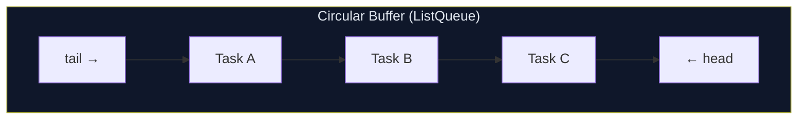

# `Queue<E>`

`Queue<E>` is a double-ended queue (**deque**) from `dart:collection`. It supports efficient O(1) addition and removal at **both** the front and the back, making it ideal for FIFO (First-In, First-Out) and LIFO (Last-In, First-Out) patterns.

---

## When to Use

✅ Use `Queue<E>` when you need to:
- Process elements in FIFO order (task queues, BFS, event systems)
- Efficiently add/remove at both ends
- Implement sliding window algorithms
- Model a print queue, message queue, or job scheduler

❌ Don't use `Queue<E>` when you need to:
- Random index access (`queue[i]` doesn't exist)
- Uniqueness guarantees → use `Set<E>`
- Key-value pairs → use `Map<K,V>`
- A plain sequential list → use `List<E>` (simpler API)

---

## Memory Layout

The default `Queue` factory creates a `ListQueue`, backed by a circular buffer:



- `addLast` / `addFirst` — O(1) amortized
- `removeFirst` / `removeLast` — O(1)
- Random access — O(n)

---

## Import

```dart
import 'dart:collection';
```

---

## Syntax

```dart
import 'dart:collection';

// Empty queue
var q = Queue<int>();

// From an iterable
var q2 = Queue.of([1, 2, 3, 4, 5]);
var q3 = Queue.from([1, 2, 3]);
```

---

## Constructors

### `Queue()` (factory)

Creates an empty `ListQueue`.

```dart
var q = Queue<String>();
q.addLast('hello');
print(q); // {hello}
```

### `Queue.of(Iterable<E> elements)`

Creates a queue containing the given elements in order.

```dart
var q = Queue.of([1, 2, 3, 4, 5]);
print(q);             // {1, 2, 3, 4, 5}
print(q.first);       // 1
print(q.last);        // 5
```

### `Queue.from(Iterable elements)`

Like `Queue.of` but accepts `Iterable<dynamic>`.

```dart
var q = Queue<int>.from([10, 20, 30]);
```

---

## Key Properties

| Property | Type | Description |
|----------|------|-------------|
| `length` | `int` | Number of elements |
| `isEmpty` | `bool` | True if no elements |
| `isNotEmpty` | `bool` | True if at least one element |
| `first` | `E` | First element (front of queue); throws if empty |
| `last` | `E` | Last element (back of queue); throws if empty |
| `single` | `E` | Only element; throws if 0 or 2+ |
| `iterator` | `Iterator<E>` | For `for-in` loops |

---

## Methods — Complete Reference

### Adding Elements

#### `addFirst(E value)`

Inserts at the **front** of the queue. O(1).

```dart
var q = Queue.of([2, 3, 4]);
q.addFirst(1);
print(q); // {1, 2, 3, 4}
```

#### `addLast(E value)`

Inserts at the **back** of the queue. O(1).

```dart
var q = Queue.of([1, 2, 3]);
q.addLast(4);
print(q); // {1, 2, 3, 4}
```

#### `add(E value)`

Alias for `addLast`. Implements `Iterable.add`.

```dart
var q = Queue<int>();
q.add(1);
q.add(2);
q.add(3);
print(q); // {1, 2, 3}
```

#### `addAll(Iterable<E> iterable)`

Adds all elements at the back.

```dart
var q = Queue.of([1, 2]);
q.addAll([3, 4, 5]);
print(q); // {1, 2, 3, 4, 5}
```

---

### Removing Elements

#### `removeFirst()` → `E`

Removes and returns the **front** element. O(1). Throws `StateError` if empty.

```dart
var q = Queue.of([10, 20, 30]);
print(q.removeFirst()); // 10
print(q);               // {20, 30}
```

#### `removeLast()` → `E`

Removes and returns the **back** element. O(1). Throws `StateError` if empty.

```dart
var q = Queue.of([10, 20, 30]);
print(q.removeLast()); // 30
print(q);              // {10, 20}
```

#### `remove(Object? value)` → `bool`

Removes the **first occurrence** of `value`. O(n).

```dart
var q = Queue.of([1, 2, 3, 2]);
q.remove(2);
print(q); // {1, 3, 2}
```

#### `removeWhere(bool Function(E) test)`

Removes all elements matching the predicate. O(n).

```dart
var q = Queue.of([1, 2, 3, 4, 5, 6]);
q.removeWhere((n) => n.isEven);
print(q); // {1, 3, 5}
```

#### `retainWhere(bool Function(E) test)`

Removes all elements **not** matching the predicate.

```dart
var q = Queue.of([1, 2, 3, 4, 5]);
q.retainWhere((n) => n > 2);
print(q); // {3, 4, 5}
```

#### `clear()`

Removes all elements.

```dart
var q = Queue.of([1, 2, 3]);
q.clear();
print(q); // {}
```

---

### Searching & Testing

#### `contains(Object? value)` → `bool`

Linear scan. O(n).

```dart
var q = Queue.of([1, 2, 3]);
print(q.contains(2)); // true
print(q.contains(9)); // false
```

#### `any(bool Function(E) test)` → `bool`

```dart
var q = Queue.of([1, 2, 3]);
print(q.any((n) => n > 2)); // true
```

#### `every(bool Function(E) test)` → `bool`

```dart
var q = Queue.of([2, 4, 6]);
print(q.every((n) => n.isEven)); // true
```

---

### Transformation

#### `map<T>(T Function(E) f)` → `Iterable<T>`

```dart
var q = Queue.of([1, 2, 3]);
print(q.map((n) => n * 2).toList()); // [2, 4, 6]
```

#### `where(bool Function(E) test)` → `Iterable<E>`

```dart
var q = Queue.of([1, 2, 3, 4, 5]);
print(q.where((n) => n.isOdd).toList()); // [1, 3, 5]
```

#### `toList({bool growable = true})` → `List<E>`

```dart
var q = Queue.of([1, 2, 3]);
print(q.toList()); // [1, 2, 3]
```

#### `toSet()` → `Set<E>`

```dart
var q = Queue.of([1, 2, 2, 3]);
print(q.toSet()); // {1, 2, 3}
```

---

## FIFO & LIFO Patterns

```dart
import 'dart:collection';

// ─── FIFO Queue (First-In, First-Out) ───
var fifoQueue = Queue<String>();
fifoQueue.addLast('Task A');  // enqueue
fifoQueue.addLast('Task B');
fifoQueue.addLast('Task C');

while (fifoQueue.isNotEmpty) {
  print(fifoQueue.removeFirst()); // dequeue
}
// Task A
// Task B
// Task C

// ─── LIFO Stack (Last-In, First-Out) ───
var stack = Queue<String>();
stack.addLast('Page 1');  // push
stack.addLast('Page 2');
stack.addLast('Page 3');

while (stack.isNotEmpty) {
  print(stack.removeLast()); // pop
}
// Page 3
// Page 2
// Page 1
```

---

## Performance & Complexity

| Operation | `Queue` (ListQueue) | `List` (for comparison) |
|-----------|--------------------|-----------------------|
| `addFirst()` | O(1) amortized | O(n) — shifts all |
| `addLast()` | O(1) amortized | O(1) amortized |
| `removeFirst()` | O(1) | O(n) — shifts all |
| `removeLast()` | O(1) | O(1) |
| `contains()` | O(n) | O(n) |
| Index access `[i]` | ❌ | O(1) |
| `length` | O(1) | O(1) |

:::tip
`Queue` is significantly faster than `List` for **frequent front-insertions and removals**. If you frequently call `list.removeAt(0)` or `list.insert(0, ...)`, switch to a `Queue`.
:::

---

## Real-World Examples

### Example 1: BFS (Breadth-First Search)

```dart
import 'dart:collection';

Map<String, List<String>> graph = {
  'A': ['B', 'C'],
  'B': ['D', 'E'],
  'C': ['F'],
  'D': [],
  'E': ['F'],
  'F': [],
};

List<String> bfs(String start) {
  final visited = <String>{};
  final queue   = Queue<String>();
  final order   = <String>[];

  queue.addLast(start);
  visited.add(start);

  while (queue.isNotEmpty) {
    final node = queue.removeFirst(); // FIFO
    order.add(node);
    for (final neighbor in graph[node] ?? []) {
      if (!visited.contains(neighbor)) {
        visited.add(neighbor);
        queue.addLast(neighbor);
      }
    }
  }
  return order;
}

print(bfs('A')); // [A, B, C, D, E, F]
```

### Example 2: Task Queue / Job Processor

```dart
import 'dart:collection';

class Job {
  final int id;
  final String description;
  final int priority;
  Job(this.id, this.description, {this.priority = 0});
}

class JobQueue {
  final Queue<Job> _queue = Queue();

  void enqueue(Job job) => _queue.addLast(job);

  Job? dequeue() =>
      _queue.isEmpty ? null : _queue.removeFirst();

  void processAll() {
    while (_queue.isNotEmpty) {
      final job = _queue.removeFirst();
      print('Processing job #${job.id}: ${job.description}');
    }
  }

  int get pending => _queue.length;
}

void main() {
  var queue = JobQueue();
  queue.enqueue(Job(1, 'Send email'));
  queue.enqueue(Job(2, 'Generate report'));
  queue.enqueue(Job(3, 'Backup database'));
  queue.processAll();
  // Processing job #1: Send email
  // Processing job #2: Generate report
  // Processing job #3: Backup database
}
```

### Example 3: Sliding Window

```dart
import 'dart:collection';

// Calculate moving average with a sliding window
List<double> movingAverage(List<int> data, int windowSize) {
  final window = Queue<int>();
  final result = <double>[];
  int sum = 0;

  for (final value in data) {
    window.addLast(value);
    sum += value;
    if (window.length > windowSize) {
      sum -= window.removeFirst();
    }
    if (window.length == windowSize) {
      result.add(sum / windowSize);
    }
  }
  return result;
}

var data = [1, 3, 5, 7, 9, 11, 13];
print(movingAverage(data, 3));
// [3.0, 5.0, 7.0, 9.0, 11.0]
```

### Example 4: Undo History

```dart
import 'dart:collection';

class TextEditor {
  String _text = '';
  final Queue<String> _history = Queue();
  static const int maxHistory = 50;

  void type(String addition) {
    _history.addLast(_text); // save current state
    if (_history.length > maxHistory) _history.removeFirst();
    _text += addition;
  }

  bool undo() {
    if (_history.isEmpty) return false;
    _text = _history.removeLast();
    return true;
  }

  String get text => _text;
}
```

### Example 5: Recent Items (Bounded Queue)

```dart
import 'dart:collection';

class RecentItems<T> {
  final int maxSize;
  final Queue<T> _items = Queue();

  RecentItems({this.maxSize = 10});

  void add(T item) {
    _items.remove(item); // avoid duplicates
    _items.addLast(item);
    if (_items.length > maxSize) _items.removeFirst();
  }

  List<T> get items => _items.toList();
}

void main() {
  var recentPages = RecentItems<String>(maxSize: 5);
  recentPages.add('/home');
  recentPages.add('/products');
  recentPages.add('/cart');
  recentPages.add('/home'); // moves to end
  print(recentPages.items); // [/products, /cart, /home]
}
```

---

## Common Mistakes

### ❌ Using `List` for frequent front-insertions

```dart
// ❌ SLOW: O(n) every time
var list = <int>[];
list.insert(0, newItem); // shifts all elements

// ✅ FAST: O(1)
var queue = Queue<int>();
queue.addFirst(newItem);
```

### ❌ Trying to index into a Queue

```dart
var q = Queue.of([1, 2, 3]);
q[0]; // ❌ compile error — Queue has no [] operator
q.elementAt(0); // ✅ works but O(n)

// If you need indexed access, convert to List
q.toList()[0]; // ✅
```

### ❌ Calling `first` or `last` on an empty Queue

```dart
var q = Queue<int>();
q.first; // ❌ throws StateError

// ✅ Check first
if (q.isNotEmpty) print(q.first);
```

---

## Best Practices

- **Use `Queue` for FIFO patterns** — it's O(1) at both ends vs O(n) for `List.insert(0, ...)`.
- **Prefer `Queue.of()`** when initializing from an iterable.
- **Bound your queues** for history/cache use cases to avoid unbounded growth.
- **Use `ListQueue` directly** (it's the default) unless you specifically need `DoubleLinkedQueue` node access.

---

## Comparison with Similar Collections

| Feature | `Queue<E>` | `List<E>` | `DoubleLinkedQueue<E>` |
|---------|----------|---------|----------------------|
| Add to front | O(1) | O(n) | O(1) |
| Add to back | O(1) | O(1) | O(1) |
| Remove from front | O(1) | O(n) | O(1) |
| Remove from back | O(1) | O(1) | O(1) |
| Index access | ❌ | O(1) | ❌ |
| Node references | ❌ | ❌ | ✅ |
| Import | dart:collection | core | dart:collection |

---

**Previous:** [Map\<K,V\>](./map)  
**Next:** [DoubleLinkedQueue\<E\>](./double-linked-queue)  
**Related:** [LinkedList\<E\>](./linked-list) · [Common Patterns](./patterns) · [Performance & Complexity](./performance)
