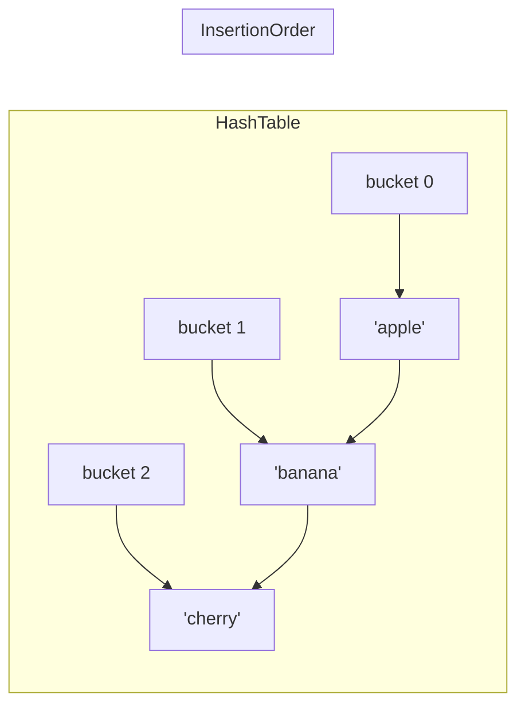
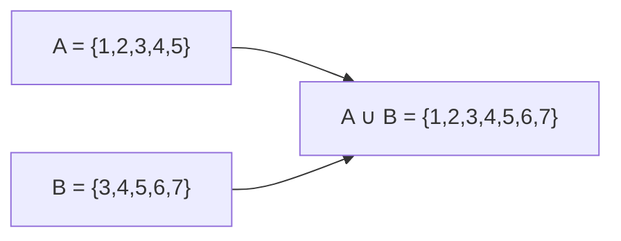
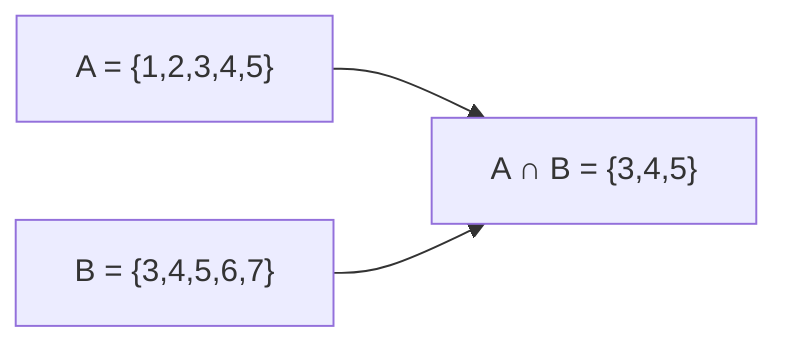
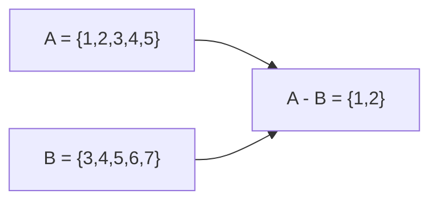

# `Set<E>`

A `Set<E>` is a collection of **unique** elements — no duplicates allowed. Sets excel at membership testing, deduplication, and mathematical set operations like union and intersection.

---

## When to Use

✅ Use `Set<E>` when you need to:
- Guarantee uniqueness (no duplicate elements)
- Fast O(1) membership testing (`contains`)
- Perform set operations: union, intersection, difference
- Deduplicate a `List`

❌ Don't use `Set<E>` when you need to:
- Access elements by index (sets have no index)
- Preserve duplicates → use `List<E>`
- Key-value pairs → use `Map<K,V>`
- Sorted unique elements → use `SplayTreeSet<E>`

---

## Memory Layout

The default `Set` literal creates a `LinkedHashSet`, which combines a hash table for O(1) lookup with a doubly-linked list to preserve insertion order.



---

## Syntax

```dart
// Set literal (creates a LinkedHashSet)
var fruits = {'apple', 'banana', 'cherry'};

// Typed
Set<String> typed = {'apple', 'banana'};
var typed2 = <String>{'apple', 'banana'};

// IMPORTANT: {} alone is an empty Map, NOT a Set!
var emptyMap = {};          // Map<dynamic, dynamic>
var emptySet = <String>{};  // ✅ Empty Set
```

:::warning
`{}` creates an **empty Map**, not a Set! Always use `<Type>{}` for an empty Set.
:::

---

## Constructors

### `Set()` / `Set.identity()`

The default `Set()` factory constructor creates a `LinkedHashSet` (insertion-ordered, hash-based).

```dart
var s = Set<int>();
s.add(1); s.add(2); s.add(3);
print(s); // {1, 2, 3}
```

`Set.identity()` uses identity (`identical()`) instead of `==` and `hashCode` for comparison.

```dart
var s = Set<List<int>>.identity();
var list1 = [1, 2, 3];
var list2 = [1, 2, 3];
s.add(list1);
print(s.contains(list2)); // false (different object)
print(s.contains(list1)); // true (same object)
```

### `Set.of(Iterable<E> elements)`

Creates a new `LinkedHashSet` containing the given elements, discarding duplicates.

```dart
var list = [1, 2, 2, 3, 3, 3, 4];
var set = Set.of(list);
print(set); // {1, 2, 3, 4}
```

### `Set.from(Iterable elements)`

Like `Set.of` but accepts `Iterable<dynamic>`. Less type-safe; prefer `Set.of`.

### `Set.unmodifiable(Iterable<E> elements)`

Creates an unmodifiable set. Any mutation attempt throws `UnsupportedError`.

```dart
var immutable = Set.unmodifiable({1, 2, 3});
immutable.add(4); // ❌ UnsupportedError
```

---

## Key Properties

| Property | Type | Description |
|----------|------|-------------|
| `length` | `int` | Number of elements |
| `isEmpty` | `bool` | True if the set has no elements |
| `isNotEmpty` | `bool` | True if the set has elements |
| `first` | `E` | First element in iteration order |
| `last` | `E` | Last element in iteration order |
| `single` | `E` | Only element; throws if 0 or 2+ |
| `iterator` | `Iterator<E>` | For `for-in` loops |

---

## Methods — Complete Reference

### Adding Elements

#### `add(E value)` → `bool`

Adds `value`. Returns `true` if added (new element), `false` if already present.

```dart
var s = <int>{1, 2, 3};
print(s.add(4)); // true  → s is {1, 2, 3, 4}
print(s.add(2)); // false → duplicate, s unchanged
```

#### `addAll(Iterable<E> elements)`

Adds all elements from the iterable, skipping duplicates.

```dart
var s = {1, 2, 3};
s.addAll([2, 3, 4, 5]);
print(s); // {1, 2, 3, 4, 5}
```

---

### Removing Elements

#### `remove(Object? value)` → `bool`

Removes `value`. Returns `true` if it was present.

```dart
var s = {1, 2, 3};
print(s.remove(2)); // true  → {1, 3}
print(s.remove(9)); // false → no change
```

#### `removeAll(Iterable<Object?> elements)`

Removes all elements in the given iterable.

```dart
var s = {1, 2, 3, 4, 5};
s.removeAll([2, 4]);
print(s); // {1, 3, 5}
```

#### `removeWhere(bool Function(E) test)`

Removes all elements matching the predicate.

```dart
var s = {1, 2, 3, 4, 5, 6};
s.removeWhere((n) => n.isEven);
print(s); // {1, 3, 5}
```

#### `retainAll(Iterable<Object?> elements)`

Removes all elements **not** in the given iterable (keeps only common elements — intersection-in-place).

```dart
var s = {1, 2, 3, 4, 5};
s.retainAll([2, 4, 6]);
print(s); // {2, 4}
```

#### `retainWhere(bool Function(E) test)`

Removes all elements that do **NOT** match the predicate.

```dart
var s = {1, 2, 3, 4, 5};
s.retainWhere((n) => n > 2);
print(s); // {3, 4, 5}
```

#### `clear()`

Removes all elements.

```dart
var s = {1, 2, 3};
s.clear();
print(s); // {}
```

---

### Searching & Testing

#### `contains(Object? value)` → `bool`

Returns true if the set contains the element. **O(1) average** for hash-based sets.

```dart
var s = {'apple', 'banana', 'cherry'};
print(s.contains('banana')); // true
print(s.contains('mango'));  // false
```

#### `containsAll(Iterable<Object?> other)` → `bool`

Returns true if the set contains every element in `other`.

```dart
var s = {1, 2, 3, 4, 5};
print(s.containsAll([1, 3, 5])); // true
print(s.containsAll([1, 6]));    // false
```

#### `any(bool Function(E) test)` → `bool`

```dart
var s = {1, 2, 3, 4};
print(s.any((n) => n > 3)); // true
```

#### `every(bool Function(E) test)` → `bool`

```dart
var s = {2, 4, 6};
print(s.every((n) => n.isEven)); // true
```

---

### Set Operations

These are the core mathematical set operations. Each returns a **new** `Set`.

#### `union(Set<E> other)` → `Set<E>`

Returns all elements in this **or** the other set (logical OR).



```dart
var a = {1, 2, 3, 4, 5};
var b = {3, 4, 5, 6, 7};
print(a.union(b)); // {1, 2, 3, 4, 5, 6, 7}
```

#### `intersection(Set<Object?> other)` → `Set<E>`

Returns elements present in **both** sets (logical AND).



```dart
var a = {1, 2, 3, 4, 5};
var b = {3, 4, 5, 6, 7};
print(a.intersection(b)); // {3, 4, 5}
```

#### `difference(Set<Object?> other)` → `Set<E>`

Returns elements in **this set** but **not** in `other`.



```dart
var a = {1, 2, 3, 4, 5};
var b = {3, 4, 5, 6, 7};
print(a.difference(b)); // {1, 2}
print(b.difference(a)); // {6, 7}
```

---

### Conversion

#### `toList({bool growable = true})` → `List<E>`

```dart
var s = {3, 1, 4, 1, 5, 9, 2, 6};
var list = s.toList();
print(list); // [3, 1, 4, 5, 9, 2, 6]  (no duplicates)
```

#### `toSet()` → `Set<E>`

Returns a copy of this set as a new `Set`.

```dart
var s = {1, 2, 3};
var copy = s.toSet();
copy.add(4);
print(s);    // {1, 2, 3}  — original unchanged
print(copy); // {1, 2, 3, 4}
```

#### `map<T>(T Function(E) f)` → `Iterable<T>`

```dart
var s = {1, 2, 3};
print(s.map((n) => n * 2).toSet()); // {2, 4, 6}
```

#### `where(bool Function(E) test)` → `Iterable<E>`

```dart
var s = {1, 2, 3, 4, 5};
print(s.where((n) => n.isOdd).toSet()); // {1, 3, 5}
```

#### `join([String separator = ''])` → `String`

```dart
print({'a', 'b', 'c'}.join(', ')); // a, b, c
```

---

## Performance & Complexity

| Operation | `HashSet` | `LinkedHashSet` | `SplayTreeSet` |
|-----------|----------|----------------|---------------|
| `add()` | O(1) avg | O(1) avg | O(log n) |
| `remove()` | O(1) avg | O(1) avg | O(log n) |
| `contains()` | O(1) avg | O(1) avg | O(log n) |
| `union()` | O(n + m) | O(n + m) | O(n log n) |
| `intersection()` | O(n) | O(n) | O(n log n) |
| Iteration | O(n) | O(n) | O(n) |
| Order | None | Insertion | Sorted |

---

## Real-World Examples

### Example 1: Deduplicating Tags

```dart
List<String> rawTags = ['flutter', 'dart', 'flutter', 'mobile', 'dart', 'dart'];
Set<String> uniqueTags = rawTags.toSet();
print(uniqueTags); // {flutter, dart, mobile}
```

### Example 2: Permission System

```dart
class User {
  final String name;
  final Set<String> permissions;

  User(this.name, this.permissions);

  bool can(String action) => permissions.contains(action);

  bool canAll(Iterable<String> actions) => permissions.containsAll(actions);
}

var admin = User('Alice', {'read', 'write', 'delete', 'admin'});
var viewer = User('Bob', {'read'});

print(admin.can('delete'));              // true
print(viewer.can('write'));             // false
print(admin.canAll(['read', 'write'])); // true

// Find shared permissions
var shared = admin.permissions.intersection(viewer.permissions);
print(shared); // {read}
```

### Example 3: Search History (Unique, Ordered)

```dart
class SearchHistory {
  final LinkedHashSet<String> _history = LinkedHashSet();
  static const int maxEntries = 10;

  void add(String query) {
    _history.remove(query); // Move to end if exists
    _history.add(query);
    while (_history.length > maxEntries) {
      _history.remove(_history.first);
    }
  }

  List<String> get recent => _history.toList().reversed.toList();
}
```

### Example 4: Graph — Visited Nodes

```dart
// BFS using a Set to track visited nodes
Map<int, List<int>> graph = {
  1: [2, 3],
  2: [4, 5],
  3: [5, 6],
  4: [],
  5: [6],
  6: [],
};

List<int> bfs(int start) {
  final visited = <int>{};
  final queue = Queue<int>();
  final result = <int>[];

  queue.add(start);
  visited.add(start);

  while (queue.isNotEmpty) {
    final node = queue.removeFirst();
    result.add(node);
    for (final neighbor in graph[node] ?? []) {
      if (!visited.contains(neighbor)) {
        visited.add(neighbor);
        queue.add(neighbor);
      }
    }
  }
  return result;
}

import 'dart:collection';
print(bfs(1)); // [1, 2, 3, 4, 5, 6]
```

---

## Flutter Examples

### Multi-select with a Set

```dart
class MultiSelectList extends StatefulWidget {
  final List<String> items;
  const MultiSelectList({required this.items, super.key});

  @override
  State<MultiSelectList> createState() => _MultiSelectListState();
}

class _MultiSelectListState extends State<MultiSelectList> {
  final Set<String> _selected = {};

  @override
  Widget build(BuildContext context) {
    return Column(children: [
      ...widget.items.map((item) => CheckboxListTile(
            title: Text(item),
            value: _selected.contains(item),
            onChanged: (checked) => setState(() =>
                checked! ? _selected.add(item) : _selected.remove(item)),
          )),
      Text('Selected: ${_selected.join(', ')}'),
    ]);
  }
}
```

---

## Common Mistakes

### ❌ Using `{}` for an empty set

```dart
var s = {};      // ❌ This is Map<dynamic, dynamic>!
var s = <int>{}; // ✅ This is Set<int>
```

### ❌ Expecting a specific iteration order from `HashSet`

```dart
import 'dart:collection';
var hs = HashSet.of([3, 1, 4, 1, 5]);
// ❌ Don't assume order — HashSet is unordered
for (var n in hs) print(n); // order is undefined

// ✅ Use LinkedHashSet or sort the result
var sorted = hs.toList()..sort();
```

### ❌ Using `List.contains()` for large membership tests

```dart
var list = List.generate(10000, (i) => i);

// ❌ O(n) every call — very slow for many lookups
if (list.contains(9999)) { ... }

// ✅ Convert to Set once, then O(1) lookups
var set = list.toSet();
if (set.contains(9999)) { ... }
```

### ❌ Comparing sets with `==`

```dart
var a = {1, 2, 3};
var b = {1, 2, 3};
print(a == b); // false — different object references

// ✅ Use SetEquality from package:collection
import 'package:collection/collection.dart';
print(const SetEquality().equals(a, b)); // true

// ✅ Or check containsAll in both directions
print(a.containsAll(b) && b.containsAll(a)); // true
```

---

## Best Practices

- **Use `Set` for membership testing** instead of `List` when the collection is large.
- **Use `Set.of(list)` for deduplication** — it's one-liner and idiomatic.
- **Prefer `LinkedHashSet`** (the default) when you need predictable iteration order.
- **Use `HashSet`** when order doesn't matter and you want maximum performance.
- **Use `SplayTreeSet`** when you need sorted iteration.
- **Use `const {...}` for compile-time constant sets**.

---

## Comparison with Similar Collections

| Feature | `Set<E>` | `List<E>` | `HashSet<E>` | `SplayTreeSet<E>` |
|---------|---------|---------|------------|----------------|
| Unique | ✅ | ❌ | ✅ | ✅ |
| Ordered | Insertion | Position | ❌ | Sorted |
| Index access | ❌ | ✅ | ❌ | ❌ |
| `contains()` | O(1) | O(n) | O(1) | O(log n) |
| Import | core | core | dart:collection | dart:collection |

---

**Previous:** [List\<E\>](./list)  
**Next:** [Map\<K,V\>](./map)  
**Related:** [HashSet\<E\>](./hashset) · [LinkedHashSet\<E\>](./linked-hashset) · [SplayTreeSet\<E\>](./splay-tree-set) · [Collection Equality](./equality)
