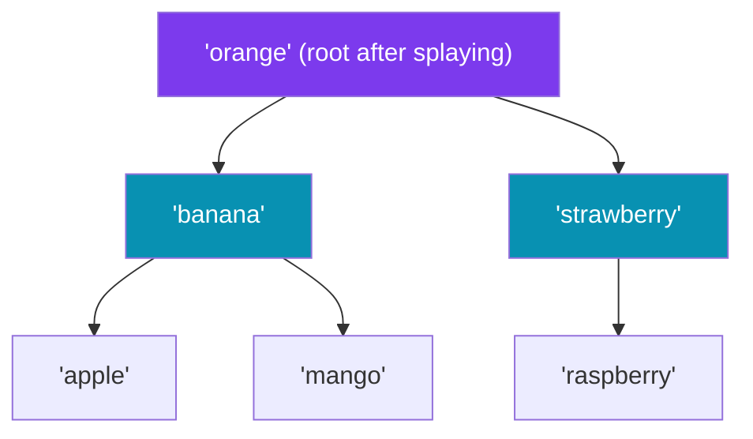

# `SplayTreeMap<K, V>`

`SplayTreeMap<K, V>` is a `Map` implementation backed by a **self-adjusting binary search tree** (splay tree). Its defining property: keys are always iterated in **sorted order**, and recently accessed keys are moved to the root (locality optimization).

---

## When to Use

✅ Use `SplayTreeMap<K, V>` when you need:
- **Sorted key iteration** (alphabetical, numerical, etc.)
- **Range queries** — efficiently find all entries between two keys
- **Nearest-neighbor lookups** — find the key just above or below a target
- **Priority-like structures** where min/max key matters

❌ Don't use `SplayTreeMap<K, V>` when you need:
- Maximum speed for individual lookups → use `HashMap`
- Insertion order → use `LinkedHashMap`
- A simple key-value store → use the default `Map`

---

## Internal: The Splay Tree

A splay tree is a **self-adjusting BST** where every accessed node is "splayed" (rotated) to the root. This means recently used keys are fast to access again.



Properties:
- BST property: `left key < root < right key`
- Amortized O(log n) for all operations
- Sequential access (sorted iteration) is O(n) total

---

## Import

```dart
import 'dart:collection';
```

---

## Constructors

### `SplayTreeMap()`

Creates a `SplayTreeMap` using the natural `Comparable` order of the keys.

```dart
import 'dart:collection';

var map = SplayTreeMap<String, int>();
map['banana'] = 2;
map['apple'] = 1;
map['cherry'] = 3;
map['avocado'] = 4;

// Always iterates in sorted key order
print(map.keys.toList()); // [apple, avocado, banana, cherry]
```

### `SplayTreeMap(int Function(K a, K b) compare)`

Creates with a **custom comparator**. This is the most powerful constructor.

```dart
import 'dart:collection';

// Reverse alphabetical order
var map = SplayTreeMap<String, int>((a, b) => b.compareTo(a));
map['banana'] = 2;
map['apple'] = 1;
map['cherry'] = 3;
print(map.keys.toList()); // [cherry, banana, apple]

// By string length (shortest first)
var byLength = SplayTreeMap<String, int>((a, b) {
  final lenCmp = a.length.compareTo(b.length);
  return lenCmp != 0 ? lenCmp : a.compareTo(b); // stable: alphabetical for equal lengths
});
byLength['banana'] = 1;
byLength['fig'] = 2;
byLength['apple'] = 3;
print(byLength.keys.toList()); // [fig, apple, banana]
```

### `SplayTreeMap.of(Map<K, V> other, [int Function(K, K)? compare])`

Creates from an existing map with optional custom comparator.

```dart
var source = {'b': 2, 'a': 1, 'c': 3};
var sorted = SplayTreeMap.of(source);
print(sorted.keys.toList()); // [a, b, c]
```

### `SplayTreeMap.from(Map other, [int Function(K, K)? compare])`

Like `.of()` but accepts `Map<dynamic, dynamic>`.

### `SplayTreeMap.fromIterables(Iterable<K> keys, Iterable<V> values, [compare])`

```dart
var map = SplayTreeMap.fromIterables(
  ['c', 'a', 'b'],
  [3, 1, 2],
);
print(map.keys.toList()); // [a, b, c]
```

---

## Key Properties

| Property | Type | Description |
|----------|------|-------------|
| `length` | `int` | Number of entries |
| `isEmpty` / `isNotEmpty` | `bool` | Emptiness check |
| `keys` | `Iterable<K>` | Keys in **sorted order** |
| `values` | `Iterable<V>` | Values in sorted key order |
| `entries` | `Iterable<MapEntry<K,V>>` | Entries in sorted key order |
| `firstKey()` | `K` | Smallest key |
| `lastKey()` | `K` | Largest key |
| `firstKeyAfter(K)` | `K?` | Smallest key **greater than** the given key |
| `lastKeyBefore(K)` | `K?` | Largest key **less than** the given key |

---

## Methods — Complete Reference

### Standard Map Methods

All [Map\<K,V\>](./map) methods apply (`[]`, `[]=`, `remove`, `containsKey`, `forEach`, `map`, `putIfAbsent`, `update`, etc.) with O(log n) complexity instead of O(1).

---

### SplayTreeMap-Specific Methods

#### `firstKey()` → `K`

Returns the **smallest** key. O(log n).

```dart
var map = SplayTreeMap.of({'banana': 2, 'apple': 1, 'cherry': 3});
print(map.firstKey()); // apple
```

#### `lastKey()` → `K`

Returns the **largest** key. O(log n).

```dart
print(map.lastKey()); // cherry
```

#### `firstKeyAfter(K key)` → `K?`

Returns the smallest key **strictly greater than** `key`. Returns `null` if none.

```dart
var map = SplayTreeMap.of({'a': 1, 'c': 3, 'e': 5, 'g': 7});
print(map.firstKeyAfter('c')); // e
print(map.firstKeyAfter('g')); // null (no key after 'g')
```

#### `lastKeyBefore(K key)` → `K?`

Returns the largest key **strictly less than** `key`. Returns `null` if none.

```dart
print(map.lastKeyBefore('e')); // c
print(map.lastKeyBefore('a')); // null (no key before 'a')
```

---

## Range Queries

The combination of `firstKeyAfter` and `lastKeyBefore` enables powerful range queries:

```dart
import 'dart:collection';

// Get all entries between two keys (inclusive)
Map<K, V> rangeQuery<K extends Comparable, V>(
  SplayTreeMap<K, V> map,
  K from,
  K to,
) {
  final result = SplayTreeMap<K, V>();
  var key = map.firstKey();
  // Or start from 'from' using firstKeyAfter
  var current = map.containsKey(from) ? from : map.firstKeyAfter(from);
  while (current != null && current.compareTo(to) <= 0) {
    result[current] = map[current]!;
    current = map.firstKeyAfter(current);
  }
  return result;
}

var prices = SplayTreeMap.of({
  10: 'budget',
  25: 'basic',
  50: 'standard',
  100: 'premium',
  200: 'enterprise',
});

var mid = rangeQuery(prices, 20, 120);
print(mid); // {25: basic, 50: standard, 100: premium}
```

---

## Performance & Complexity

| Operation | `SplayTreeMap` | `LinkedHashMap` | `HashMap` |
|-----------|---------------|----------------|---------|
| `[key]` read | O(log n) amortized | O(1) avg | O(1) avg |
| `[key]=` write | O(log n) amortized | O(1) avg | O(1) avg |
| `remove()` | O(log n) amortized | O(1) avg | O(1) avg |
| `firstKey()` | O(log n) | O(n) (via sort) | O(n) |
| `lastKey()` | O(log n) | O(n) (via sort) | O(n) |
| Sorted iteration | O(n) | O(n log n) | O(n log n) |
| Range query | O(log n + k) | O(n) | O(n) |

---

## Real-World Examples

### Example 1: Sorted Leaderboard

```dart
import 'dart:collection';

class Leaderboard {
  // Score → list of player names (multiple players can have same score)
  final SplayTreeMap<int, List<String>> _board;

  Leaderboard()
      : _board = SplayTreeMap((a, b) => b.compareTo(a)); // descending

  void addScore(String player, int score) {
    _board.putIfAbsent(score, () => []).add(player);
  }

  void printTop(int n) {
    var count = 0;
    var rank = 1;
    for (var entry in _board.entries) {
      for (var player in entry.value) {
        print('#$rank $player: ${entry.key}');
        if (++count >= n) return;
      }
      rank += entry.value.length;
    }
  }
}

void main() {
  var board = Leaderboard();
  board.addScore('Alice', 2500);
  board.addScore('Bob', 1800);
  board.addScore('Carol', 3200);
  board.addScore('Dave', 2500);

  board.printTop(3);
  // #1 Carol: 3200
  // #2 Alice: 2500
  // #2 Dave: 2500
}
```

### Example 2: Event Timeline

```dart
import 'dart:collection';

class Event {
  final String name;
  final String description;
  Event(this.name, this.description);
  @override
  String toString() => '$name: $description';
}

class Timeline {
  // DateTime → Event (sorted by time)
  final SplayTreeMap<DateTime, Event> _events = SplayTreeMap(
    (a, b) => a.compareTo(b),
  );

  void addEvent(DateTime time, Event event) => _events[time] = event;

  // Get events in a time range
  Iterable<MapEntry<DateTime, Event>> range(DateTime from, DateTime to) {
    final result = <MapEntry<DateTime, Event>>[];
    var key = _events.firstKeyAfter(from) ??
        ((_events.isNotEmpty && _events.firstKey().compareTo(from) >= 0)
            ? _events.firstKey()
            : null);
    if (_events.containsKey(from)) result.add(MapEntry(from, _events[from]!));
    key = _events.firstKeyAfter(from);
    while (key != null && key.compareTo(to) <= 0) {
      result.add(MapEntry(key, _events[key]!));
      key = _events.firstKeyAfter(key);
    }
    return result;
  }

  Event? nextEvent(DateTime after) {
    final key = _events.firstKeyAfter(after);
    return key == null ? null : _events[key];
  }
}
```

### Example 3: Dictionary / Auto-complete

```dart
import 'dart:collection';

class AutoComplete {
  final SplayTreeMap<String, String> _words = SplayTreeMap();

  void addWord(String word, String definition) =>
      _words[word] = definition;

  // Get all words starting with prefix
  List<String> suggest(String prefix) {
    final results = <String>[];
    var key = _words.containsKey(prefix) ? prefix : _words.firstKeyAfter(prefix);
    // Also check prefix itself
    if (_words.containsKey(prefix)) results.add(prefix);
    key = _words.firstKeyAfter(prefix);
    while (key != null && key.startsWith(prefix)) {
      results.add(key);
      key = _words.firstKeyAfter(key);
    }
    return results;
  }
}

void main() {
  var ac = AutoComplete();
  ac.addWord('apple', 'a fruit');
  ac.addWord('application', 'a program');
  ac.addWord('apply', 'to make an application');
  ac.addWord('apricot', 'an orange fruit');
  ac.addWord('banana', 'a yellow fruit');

  print(ac.suggest('app')); // [apple, application, apply]
  print(ac.suggest('apr')); // [apricot]
}
```

### Example 4: Price Tier Lookup

```dart
import 'dart:collection';

// Find which tier a price belongs to
class PriceTiers {
  final SplayTreeMap<double, String> _tiers = SplayTreeMap();

  void addTier(double minPrice, String name) => _tiers[minPrice] = name;

  String? tierFor(double price) {
    // Find the largest tier boundary <= price
    if (_tiers.isEmpty) return null;
    if (price < _tiers.firstKey()) return null;

    var key = _tiers.lastKeyBefore(price) ??
        (_tiers.firstKey() <= price ? _tiers.firstKey() : null);

    // If exact match
    if (_tiers.containsKey(price)) return _tiers[price];

    // Otherwise use lastKeyBefore
    key = _tiers.lastKeyBefore(price + 0.001);
    return key != null ? _tiers[key] : null;
  }
}
```

---

## Common Mistakes

### ❌ Using SplayTreeMap without Comparable keys

```dart
// ❌ Throws if K doesn't implement Comparable and no comparator given
class MyClass {}
var map = SplayTreeMap<MyClass, int>(); // runtime error on first insert

// ✅ Provide a custom comparator
var map = SplayTreeMap<MyClass, int>((a, b) => a.id.compareTo(b.id));
```

### ❌ Expecting O(1) performance

```dart
// SplayTreeMap lookups are O(log n) — not O(1) like HashMap
// For millions of lookups, HashMap is faster

// ✅ Only use SplayTreeMap when you need sorted access or range queries
```

### ❌ Mutation of keys after insertion

```dart
// Keys must be immutable once inserted
// Mutable keys that change their sort order corrupt the tree
```

---

## Best Practices

- **Use `SplayTreeMap` specifically for sorted iteration and range queries** — for pure lookups, `HashMap` is faster.
- **Always provide a `compare` function** unless your keys implement `Comparable` (like `int`, `String`, `DateTime`).
- **Use `firstKey()` / `lastKey()`** for O(log n) min/max — much better than converting keys to a list and sorting.
- **Pair with `firstKeyAfter` / `lastKeyBefore`** for efficient range queries without materializing all keys.

---

**Previous:** [LinkedHashMap\<K,V\>](./linked-hashmap)  
**Next:** [HashSet\<E\>](./hashset)  
**Related:** [SplayTreeSet\<E\>](./splay-tree-set) · [HashMap\<K,V\>](./hashmap) · [Performance & Complexity](./performance)
