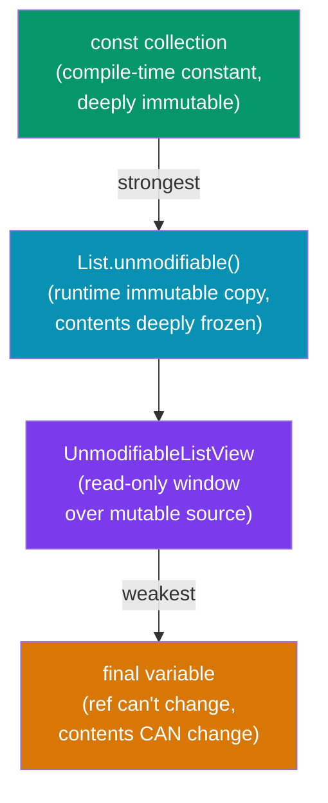

# Unmodifiable Collections

Dart provides several mechanisms to make collections **immutable** or **unmodifiable**, ranging from compile-time constants (`const`) to runtime-enforced wrappers. Understanding the differences is essential for writing safe, predictable Dart code.

---

## Levels of Immutability



| Mechanism | Variable rebind | Content mutation | Compile-time | Memory |
|-----------|----------------|-----------------|-------------|--------|
| `const` | ❌ | ❌ | ✅ | Shared/interned |
| `List.unmodifiable()` | ✅ (variable) | ❌ | ❌ | Copies data |
| `UnmodifiableListView` | ✅ | ❌ (throws) | ❌ | No copy (view) |
| `final` | ❌ | ✅ (contents) | ❌ | Normal |

---

## `const` Collections

`const` creates a **compile-time constant** that is deeply immutable. The object is canonicalized — identical `const` expressions share the same instance.

```dart
const list = [1, 2, 3];
const set  = {1, 2, 3};
const map  = {'a': 1, 'b': 2};

// ❌ Any mutation throws UnsupportedError at runtime
list.add(4);        // UnsupportedError: Cannot add to an unmodifiable list
list[0] = 99;       // UnsupportedError: Cannot modify an unmodifiable list
set.add(4);         // UnsupportedError
map['c'] = 3;       // UnsupportedError

// ✅ Reads are fine
print(list[0]); // 1
print(set.contains(2)); // true
print(map['a']); // 1
```

### Canonicalization

```dart
const a = [1, 2, 3];
const b = [1, 2, 3];
print(identical(a, b)); // true — same object in memory!
```

### `const` in Classes

```dart
class Config {
  static const List<String> supportedLocales = ['en', 'bn', 'fr', 'de'];
  static const Map<String, int> errorCodes = {
    'notFound': 404,
    'unauthorized': 401,
    'serverError': 500,
  };
}

// Use anywhere without allocation:
print(Config.supportedLocales.contains('bn')); // true
```

### `const` Constructor Parameters

```dart
// Widget trees can use const for compile-time optimization
const colors = <Color>[
  Colors.red,
  Colors.green,
  Colors.blue,
];
```

---

## `List.unmodifiable()`, `Set.unmodifiable()`, `Map.unmodifiable()`

Creates a **runtime-immutable copy**. The data is copied at creation time, so modifying the source after creation doesn't affect the unmodifiable copy.

```dart
// List
var source = [1, 2, 3];
var immutable = List.unmodifiable(source);

source.add(4);      // source changes
print(source);      // [1, 2, 3, 4]
print(immutable);   // [1, 2, 3] — unaffected

immutable.add(4);   // ❌ UnsupportedError at runtime
immutable[0] = 99;  // ❌ UnsupportedError

// Set
var immutableSet = Set.unmodifiable({1, 2, 3});
immutableSet.add(4); // ❌ UnsupportedError

// Map
var immutableMap = Map.unmodifiable({'a': 1, 'b': 2});
immutableMap['c'] = 3; // ❌ UnsupportedError
```

### When to Use

- **Public APIs**: Return unmodifiable collections from getters so callers can't mutate internal state.
- **Defensive copies**: Store a snapshot of mutable data.

```dart
class UserProfile {
  final List<String> _roles;

  UserProfile(List<String> roles)
      : _roles = List.unmodifiable(roles); // defensive copy

  // Safe to expose — callers can't mutate
  List<String> get roles => _roles;
}
```

---

## `UnmodifiableListView`, `UnmodifiableMapView`, `UnmodifiableSetView`

From `dart:collection`. These create **read-only views** — they don't copy the data. The underlying collection can still change through the original reference.

```dart
import 'dart:collection';

// ── UnmodifiableListView ──
var source = [1, 2, 3, 4, 5];
var view = UnmodifiableListView(source);

// ✅ Reads work
print(view[0]);          // 1
print(view.length);      // 5
print(view.contains(3)); // true

// ❌ Mutations throw
view.add(6);     // UnsupportedError
view[0] = 99;    // UnsupportedError

// But the source can still change!
source.add(6);
print(view.length); // 6 — view reflects the change

// ── UnmodifiableMapView ──
var mutableMap = <String, int>{'a': 1, 'b': 2};
var mapView = UnmodifiableMapView(mutableMap);
print(mapView['a']); // 1
mapView['c'] = 3;    // ❌ UnsupportedError

// ── UnmodifiableSetView ──
var mutableSet = <int>{1, 2, 3};
var setView = UnmodifiableSetView(mutableSet);
print(setView.contains(2)); // true
setView.add(4);              // ❌ UnsupportedError
```

### Key Difference: View vs Copy

| | `UnmodifiableListView` | `List.unmodifiable()` |
|---|----------------------|----------------------|
| Copies data | ❌ (no allocation) | ✅ (allocates) |
| Reflects source changes | ✅ | ❌ |
| Memory | Minimal | Full copy |
| Best for | Exposing internals safely | Immutable snapshots |

---

## Practical Patterns

### Pattern 1: Safe Getter with `UnmodifiableListView`

```dart
import 'dart:collection';

class Cart {
  final List<String> _items = [];

  void add(String item) => _items.add(item);
  void remove(String item) => _items.remove(item);

  // Expose a read-only view — callers see live data but can't mutate
  List<String> get items => UnmodifiableListView(_items);
}

void main() {
  var cart = Cart();
  cart.add('Apple');
  cart.add('Banana');

  var items = cart.items;
  print(items); // [Apple, Banana]
  items.add('Cherry'); // ❌ UnsupportedError — can't mutate!
}
```

### Pattern 2: Immutable Value Object

```dart
class Permissions {
  final Set<String> _perms;

  Permissions(Iterable<String> perms)
      : _perms = Set.unmodifiable(Set.of(perms));

  bool has(String permission) => _perms.contains(permission);
  Set<String> get all => _perms;

  Permissions withAdded(String permission) =>
      Permissions({..._perms, permission});

  Permissions withRemoved(String permission) =>
      Permissions(_perms.where((p) => p != permission));
}

void main() {
  var perms = Permissions(['read', 'write']);
  var adminPerms = perms.withAdded('delete');
  print(perms.all);      // {read, write}      — original unchanged
  print(adminPerms.all); // {read, write, delete}
}
```

### Pattern 3: Const Collection Constants

```dart
// Perfect for configuration, feature flags, allowed values
const allowedExtensions = {'.dart', '.yaml', '.json', '.md'};
const defaultHeaders = {
  'Content-Type': 'application/json',
  'Accept': 'application/json',
};
const emptyList = <String>[];

// Reuse without allocation cost
bool isAllowed(String ext) => allowedExtensions.contains(ext);
```

### Pattern 4: Freezing Bloc/Provider State

```dart
import 'dart:collection';

class AppState {
  final List<String> messages;
  final Map<String, bool> features;

  AppState({
    required List<String> messages,
    required Map<String, bool> features,
  })  : messages = List.unmodifiable(messages),
        features = Map.unmodifiable(features);

  AppState copyWith({
    List<String>? messages,
    Map<String, bool>? features,
  }) =>
      AppState(
        messages: messages ?? this.messages,
        features: features ?? this.features,
      );
}
```

---

## `final` vs `const` vs `unmodifiable`

```dart
// final: variable can't be reassigned, but contents can change
final list1 = [1, 2, 3];
list1.add(4);   // ✅ fine — contents can change
list1 = [5, 6]; // ❌ compile error — can't reassign

// const: variable can't be reassigned AND contents are immutable
const list2 = [1, 2, 3];
list2.add(4);   // ❌ UnsupportedError at runtime
list2 = [5, 6]; // ❌ compile error

// unmodifiable: contents can't change, variable can be reassigned
var list3 = List.unmodifiable([1, 2, 3]);
list3.add(4);   // ❌ UnsupportedError at runtime
list3 = [5, 6]; // ✅ fine — just reassigning the variable
```

---

## Common Mistakes

### ❌ Thinking `final` means immutable content

```dart
final list = [1, 2, 3];
list.add(4); // ✅ This works! final only locks the variable, not contents.
```

### ❌ Mutating `const` in a `const` constructor

```dart
const myList = [1, 2, 3];
// At runtime:
myList[0] = 99; // ❌ UnsupportedError — but no compile-time check!
// Dart can't always warn you at compile time — be careful.
```

### ❌ Using `UnmodifiableListView` and expecting isolation from source

```dart
import 'dart:collection';

var source = [1, 2, 3];
var view = UnmodifiableListView(source);
source.add(4);
print(view.length); // 4 — view sees the change!
// If you want isolation, use List.unmodifiable() instead
```

### ❌ Returning mutable internal state from a getter

```dart
class Store {
  final List<String> _items = [];

  // ❌ Caller can mutate internal state!
  List<String> get items => _items;

  // ✅ Safe: return unmodifiable view
  List<String> get items => UnmodifiableListView(_items);
}
```

---

## Best Practices

- **Use `const` for compile-time known collections** — zero runtime cost, shared instances.
- **Use `List.unmodifiable()` for immutable snapshots** passed across API boundaries.
- **Use `UnmodifiableListView` in getters** to expose internal lists without copying them.
- **Always use `List.unmodifiable()` in value objects** that must never change.
- **Use `final` for collection variables** that won't be reassigned, even if contents change.
- **Document immutability intent** with a comment when using `UnmodifiableListView`.

---

**Previous:** [SplayTreeSet\<E\>](./splay-tree-set)  
**Next:** [Collection Literals](./literals)  
**Related:** [Best Practices](./best-practices) · [Common Mistakes](./mistakes) · [Choosing the Right Collection](./choosing)
