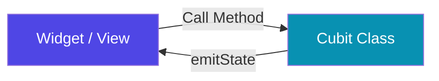

# Cubit

A **Cubit** is a simplified version of a `Bloc` from the `flutter_bloc` package. It eliminates the need for defining custom Event classes, allowing you to trigger state changes by directly calling methods (functions).

---

## 1. What is a Cubit?

While a standard `Bloc` takes **Events** as inputs and emits **States** as outputs, a `Cubit` takes **Methods** as inputs and emits **States** as outputs.



### Key Differences

| Feature | Cubit | Bloc |
|---|---|---|
| **Input** | Methods / Functions | Events |
| **Output** | States | States |
| **Complexity** | Low to Medium | Medium to High |
| **Traceability** | Simpler | Higher (via Event transition logs) |
| **Event Buffering** | No (instant execution) | Yes (using RxDart transformers) |

---

## 2. Code Example: Counter Cubit

Here is a clean implementation of a Counter state manager using `Cubit`.

### Step 1: Define the Cubit
```dart
import 'package:flutter_bloc/flutter_bloc.dart';

class CounterCubit extends Cubit<int> {
  // Pass the initial state to the super constructor
  CounterCubit() : super(0);

  // Define methods to mutate state
  void increment() => emit(state + 1);
  void decrement() => emit(state - 1);
}
```

### Step 2: Consume the Cubit in the UI
```dart
import 'package:flutter/material.dart';
import 'package:flutter_bloc/flutter_bloc.dart';

class CounterPage extends StatelessWidget {
  const CounterPage({super.key});

  @override
  Widget build(BuildContext context) {
    return Scaffold(
      appBar: AppBar(title: const Text('Cubit Counter')),
      body: BlocBuilder<CounterCubit, int>(
        builder: (context, count) {
          return Center(
            child: Text(
              '$count',
              style: Theme.of(context).textTheme.headlineMedium,
            ),
          );
        },
      ),
      floatingActionButton: Column(
        mainAxisAlignment: MainAxisAlignment.end,
        crossAxisAlignment: CrossAxisAlignment.end,
        children: [
          FloatingActionButton(
            onPressed: () => context.read<CounterCubit>().increment(),
            child: const Icon(Icons.add),
          ),
          const SizedBox(height: 8),
          FloatingActionButton(
            onPressed: () => context.read<CounterCubit>().decrement(),
            child: const Icon(Icons.remove),
          ),
        ],
      ),
    );
  }
}
```

---

## 3. When to Use Cubit vs. Bloc

* Use **Cubit** when:
  - The state transitions are simple (e.g. toggles, fetching lists, loading indicators).
  - You do not need to buffer, debounce, or throttle inputs.
  - You want to write less boilerplate.

* Use **Bloc** when:
  - State changes are highly complex and depend on event histories.
  - You need advanced stream operators (e.g. debouncing search queries, delaying clicks, throttling events).
  - You require absolute traceability of every event dispatched in the app.
