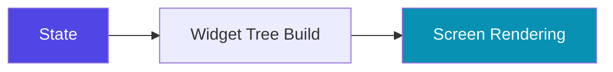
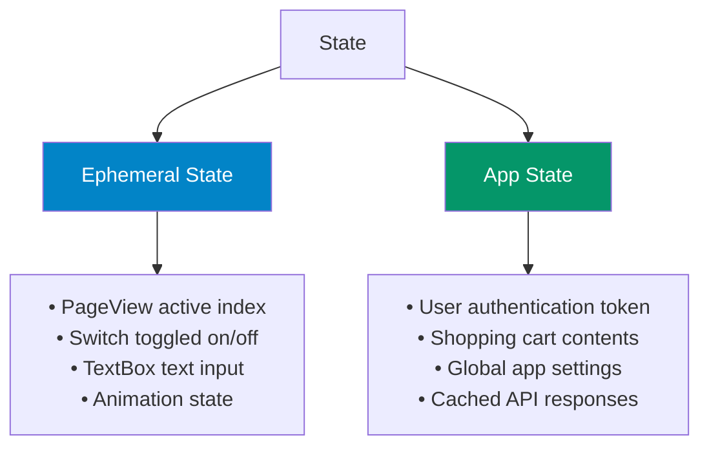
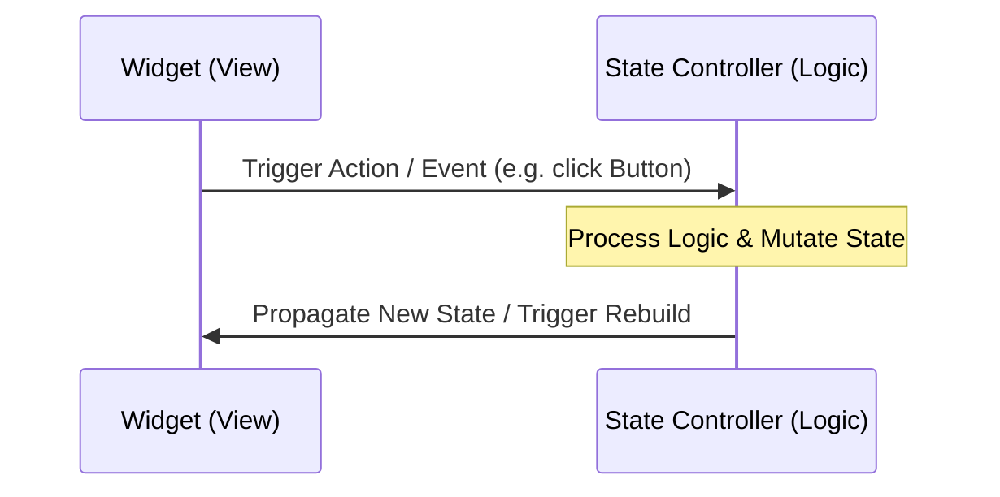

# Concepts & Architecture

To write clean Flutter applications, you must understand the fundamental principles behind Flutter's rendering and data systems.

---

## 1. The Declarative Paradigm

Unlike imperative frameworks (where you manually update UI elements like `textView.setText("Hello")`), Flutter is **declarative**. 

In Flutter, you do not modify widgets directly. Instead, you change the **state**, and Flutter rebuilds the user interface from scratch.

$$UI = f(State)$$

Where:
* **$State$**: The data representing your application's current condition.
* **$f$**: Your widget tree build methods.
* **$UI$**: The actual layout rendered on the screen.

When state changes, Flutter detects which parts of the widget tree need updating and redraws them. This makes UI development simpler, as you only need to describe how the UI should look for any given state.

---

## 2. Ephemeral vs. App State

State is generally divided into two types: **Ephemeral (Local) State** and **App (Global) State**.

### Ephemeral State
* **Definition**: State that lives inside a single widget and doesn't need to be shared or accessed elsewhere.
* **Examples**: Current index of a `TabController`, whether a checkbox is checked, or if an accordion panel is expanded.
* **Primary Tool**: `setState()` inside a `StatefulWidget`.

### App State
* **Definition**: State that is shared across multiple parts of the application or needs to persist between sessions.
* **Examples**: Shopping cart items, user profile credentials, global theme configurations.
* **Primary Tools**: `InheritedWidget`, BLoc, Riverpod, Provider, GetX.

---

## 3. Unidirectional Data Flow (UDF)

In a well-designed Flutter architecture, data flows in one direction:
1. **Events/User Actions** flow **up** (from UI to state controllers).
2. **State updates** flow **down** (from state controllers to UI).

### Why Unidirectional Flow?
* **Predictability**: You always know what event triggered a state change.
* **Testability**: You can test business logic (inputs to outputs) without rendering widgets.
* **Separation of Concerns**: UI widgets only handle presentation, while state classes only handle data.
