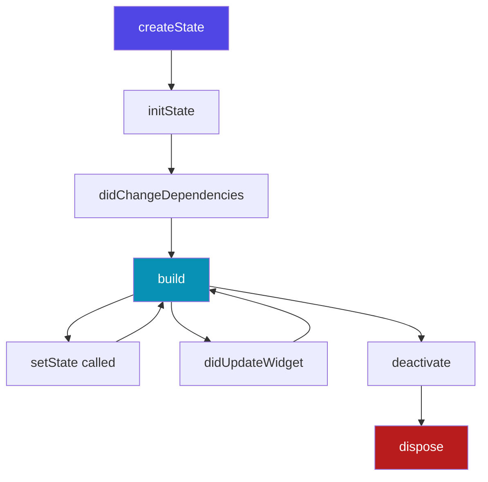

# Ephemeral State & setState

**Ephemeral State** (sometimes called local state) is state that you can cleanly contain inside a single widget. It doesn't need to be shared across screens or modified by external business logic.

Flutter provides the built-in `StatefulWidget` and `setState()` API specifically for this purpose.

---

## 1. How `setState()` Works

When you call `setState(VoidCallback fn)`, you are doing two things:
1. Executing the code inside the callback function `fn` (which typically mutates a local state variable).
2. Marking the widget's `State` object as "dirty."

In the next frame pipeline, Flutter's rendering agent detects the dirty state and triggers the widget's `build()` method to reconstruct the widget tree with the new values.

---

## 2. Code Example: A Stateful Counter

Here is a complete, real-world example of using `setState()` to manage a simple counter with input limits:

```dart
import 'package:flutter/material.dart';

class CounterWidget extends StatefulWidget {
  const CounterWidget({super.key});

  @override
  State<CounterWidget> createState() => _CounterWidgetState();
}

class _CounterWidgetState extends State<CounterWidget> {
  // 1. Declare local state variables
  int _counter = 0;
  final int _maxLimit = 10;

  void _incrementCounter() {
    // 2. Call setState to notify Flutter of mutations
    setState(() {
      if (_counter < _maxLimit) {
        _counter++;
      }
    });
  }

  void _decrementCounter() {
    setState(() {
      if (_counter > 0) {
        _counter--;
      }
    });
  }

  @override
  Widget build(BuildContext context) {
    final reachedMax = _counter == _maxLimit;

    return Card(
      child: Padding(
        padding: const EdgeInsets.all(16.0),
        child: Column(
          mainAxisSize: MainAxisSize.min,
          children: [
            Text(
              'Counter: $_counter',
              style: Theme.of(context).textTheme.headlineMedium,
            ),
            const SizedBox(height: 16),
            Row(
              mainAxisAlignment: MainAxisAlignment.center,
              children: [
                IconButton(
                  onPressed: _counter > 0 ? _decrementCounter : null,
                  icon: const Icon(Icons.remove),
                ),
                IconButton(
                  onPressed: !reachedMax ? _incrementCounter : null,
                  icon: const Icon(Icons.add),
                ),
              ],
            ),
            if (reachedMax)
              const Text(
                'Maximum limit reached!',
                style: TextStyle(color: Colors.red, fontWeight: FontWeight.bold),
              ),
          ],
        ),
      ),
    );
  }
}
```

---

## 3. The `State` Lifecycle

When working with `StatefulWidget`, you should understand key lifecycle hooks:



* **`initState()`**: Called exactly once when the widget is inserted into the tree. Ideal for initializing controllers, animations, or subscriptions.
* **`didChangeDependencies()`**: Called immediately after `initState` and when inherited dependencies change (e.g., changes in `Theme` or `MediaQuery`).
* **`build()`**: Called repeatedly whenever state changes or the parent widget updates. Must remain side-effect free.
* **`didUpdateWidget()`**: Called when the parent widget rebuilds and passes new configurations/properties to this widget.
* **`dispose()`**: Called when the widget is permanently removed from the tree. Use this to clean up resources (e.g., close stream controllers, dispose text controllers).

---

## 4. Performance Pitfalls & Best Practices

Using `setState()` is fast, but bad patterns can degrade UI performance (leading to dropped frames or lag).

### Pitfall: Rebuilding Too Much
When you call `setState()`, the **entire** widget tree returned by that `build()` method is reconstructed. If you have a large widget containing a `setState()` for a small visual detail, you are wasting CPU cycles.

```dart
// BAD: Rebuilding the whole dashboard for one input
class DashboardWidget extends StatefulWidget {
  @override
  _DashboardWidgetState createState() => _DashboardWidgetState();
}

class _DashboardWidgetState extends State<DashboardWidget> {
  bool _switchVal = false;

  @override
  Widget build(BuildContext context) {
    return Column(
      children: [
        HugeComplexChart(), // Rebuilt unnecessarily!
        HeavyListWidget(),   // Rebuilt unnecessarily!
        Switch(
          value: _switchVal,
          onChanged: (val) => setState(() => _switchVal = val),
        ),
      ],
    );
  }
}
```

### Optimization: Push State Down
To prevent unnecessary parent rebuilds, isolate state within small, dedicated child widgets.

```dart
// GOOD: Heavy widgets are unaffected when the switch state changes
class DashboardWidget extends StatelessWidget {
  @override
  Widget build(BuildContext context) {
    return Column(
      children: [
        HugeComplexChart(), // Never rebuilds when switch changes
        HeavyListWidget(),   // Never rebuilds when switch changes
        const LocalSwitchWidget(),
      ],
    );
  }
}

class LocalSwitchWidget extends StatefulWidget {
  const LocalSwitchWidget({super.key});

  @override
  State<LocalSwitchWidget> createState() => _LocalSwitchWidgetState();
}

class _LocalSwitchWidgetState extends State<LocalSwitchWidget> {
  bool _switchVal = false;

  @override
  Widget build(BuildContext context) {
    return Switch(
      value: _switchVal,
      onChanged: (val) => setState(() => _switchVal = val),
    );
  }
}
```
