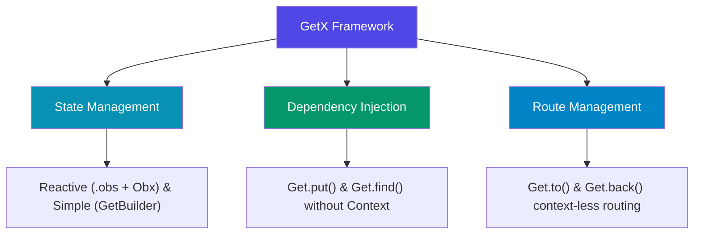

# Introduction to GetX

**GetX** is an ultra-lightweight, high-performance, and feature-rich library for Flutter. It combines state management, dependency injection, and route management in a unified package that does not rely on `BuildContext` or build context traversal.

---

## 1. The Three Pillars of GetX

GetX is built on three core functionalities that operate independently:

* **State Management**: Reactive and simple options that don't trigger unnecessary widget rebuilds.
* **Dependency Injection**: Resolves dependencies dynamically using a simple service locator pattern.
* **Route Management**: Simplifies transitions, dialogs, and navigation routes without requiring `BuildContext`.

---

## 2. Upcoming Topics

This section is a work-in-progress. In future updates, we will add detailed guides and complete code examples for the following topics:

### 🔄 Reactive State Management (.obs & Obx)
Declaring variables reactive by appending `.obs` (e.g. `var count = 0.obs`). Consuming these variables dynamically using `Obx` or `GetX` builders which automatically update only when the target variable values mutate.

### 🧩 GetxController Lifecycle
Using `GetxController` to encapsulate UI logic. Learn how to leverage built-in lifecycle hooks:
- `onInit()`: Setup logic, opening database connections or streams.
- `onReady()`: Triggered once the widget is fully rendered on screen (perfect for navigation actions or dialog popups).
- `onClose()`: Auto-disposes controllers and frees device RAM.

### 💉 Dependency Injection (Get.put & Get.find)
Declaring and sharing controllers dynamically. Learn differences between:
- `Get.put()`: Synchronously loads a dependency.
- `Get.lazyPut()`: Loads a dependency lazily (instantiates only when called for the first time).
- `Get.find()`: Locates the active dependency instance globally.

### 🗺️ Context-less Route Navigation
Navigating without `BuildContext` using `Get.to()`, `Get.off()`, and `Get.back()`. Handling route transitions and custom transitions efficiently.
