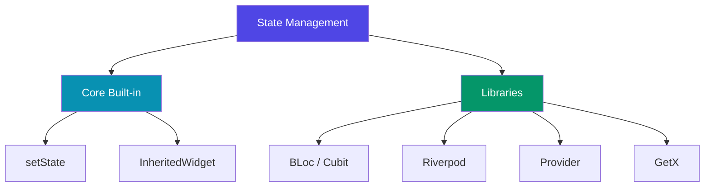

# Flutter State Management

State management is one of the most critical aspects of building robust, performant, and maintainable Flutter applications. As your application grows in complexity, managing where your data lives, how it is modified, and how your UI reacts to data changes becomes a primary architectural concern.

This documentation section is divided into two parts: **Core State Management** (built directly into the Flutter SDK) and **State Management Libraries** (advanced community-standard solutions).

---

## Core Architecture & SDK Tools

Before adopting any external library, it is essential to master Flutter's built-in state management tools. Every advanced package sits on top of these fundamental concepts.

| Topic | Description |
|---|---|
| [**Concepts & Architecture**](./concepts-and-architecture.md) | Understanding declarative UI, unidirectional data flow, and Ephemeral vs. App state. |
| [**setState & Ephemeral State**](./ephemeral-state-setstate.md) | Deep dive into local state management using `StatefulWidget` and `setState()`. |
| [**InheritedWidget**](./inherited-widget-basics.md) | Propagating read-only and reactive data down the widget tree without prop drilling. |

---

## State Management Libraries

When your application grows and demands modularity, testability, and global state tracking, community packages offer structured architectures.

### Supported Libraries

1. **[BLoc](./bloc/)**
   - A predictable state management library based on Reactive Programming (Streams). Decouples business logic from presentation.
2. **[Riverpod](./riverpod/)**
   - A reactive caching and state-management framework. It is compile-safe, testable, and has no dependency on the widget tree.
3. **[Provider](./provider/)**
   - A wrapper around `InheritedWidget` to make state sharing and updates extremely easy, clean, and reusable.
4. **[GetX](./getx/)**
   - An ultra-lightweight and powerful solution combining high-performance state management, dependency injection, and route management.
