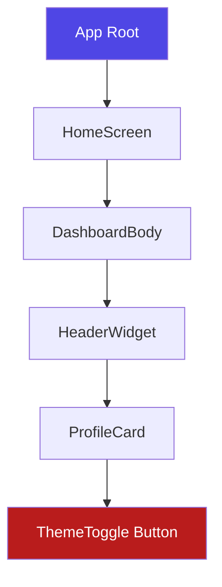

# InheritedWidget

**InheritedWidget** is a special low-level base class in Flutter. It is designed to propagate data efficiently from a parent widget down to any of its descendants in the widget tree, without having to manually pass variables through constructors (a problem known as **Prop Drilling**).

Advanced packages like `Provider` and `scoped_model` are built entirely on top of `InheritedWidget`.

---

## 1. The Prop Drilling Problem

Imagine you have a `ThemeSettings` object at the root of your application, and a small `ThemeToggle` button 5 levels deep in the widget tree.



Without `InheritedWidget`, you would have to pass `themeData` through the constructor of `HomeScreen`, `DashboardBody`, `HeaderWidget`, `ProfileCard`, and finally `ThemeToggle`. This is boilerplate-heavy, error-prone, and hard to maintain.

With `InheritedWidget`, the `ThemeToggle` can fetch the settings directly in $O(1)$ time complexity:

```dart
final settings = ThemeProvider.of(context);
```

---

## 2. Complete Code Example

Here is a complete, working implementation of a theme config sharing mechanism using a custom `InheritedWidget` and a stateful wrapper.

### Step 1: Create the InheritedWidget
```dart
import 'package:flutter/material.dart';

class ThemeProvider extends InheritedWidget {
  final String themeName;
  final VoidCallback toggleTheme;

  const ThemeProvider({
    super.key,
    required this.themeName,
    required this.toggleTheme,
    required super.child,
  });

  // Convenice helper to lookup the widget from the build context
  static ThemeProvider? of(BuildContext context) {
    return context.dependOnInheritedWidgetOfExactType<ThemeProvider>();
  }

  // Determine if dependent widgets should rebuild when properties change
  @override
  bool updateShouldNotify(ThemeProvider oldWidget) {
    return oldWidget.themeName != themeName;
  }
}
```

### Step 2: Create a Stateful Wrapper
An `InheritedWidget` is immutable. To update its data and trigger rebuilds, wrap it in a `StatefulWidget`:

```dart
class ThemeStateContainer extends StatefulWidget {
  final Widget child;

  const ThemeStateContainer({super.key, required this.child});

  @override
  State<ThemeStateContainer> createState() => _ThemeStateContainerState();
}

class _ThemeStateContainerState extends State<ThemeStateContainer> {
  String _themeName = 'Light';

  void _toggleTheme() {
    setState(() {
      _themeName = _themeName == 'Light' ? 'Dark' : 'Light';
    });
  }

  @override
  Widget build(BuildContext context) {
    return ThemeProvider(
      themeName: _themeName,
      toggleTheme: _toggleTheme,
      child: widget.child,
    );
  }
}
```

### Step 3: Consume in Descendant Widgets
Now, place `ThemeStateContainer` at the root, and any widget underneath can consume and trigger changes:

```dart
class MyApp extends StatelessWidget {
  const MyApp({super.key});

  @override
  Widget build(BuildContext context) {
    return const ThemeStateContainer(
      child: MaterialApp(
        home: HomeScreen(),
      ),
    );
  }
}

class HomeScreen extends StatelessWidget {
  const HomeScreen({super.key});

  @override
  Widget build(BuildContext context) {
    // 1. Obtain the nearest InheritedWidget instance
    final themeProvider = ThemeProvider.of(context);
    final theme = themeProvider?.themeName ?? 'Default';

    return Scaffold(
      appBar: AppBar(title: Text('Theme: $theme')),
      body: Center(
        child: ElevatedButton(
          onPressed: themeProvider?.toggleTheme,
          child: const Text('Toggle Theme'),
        ),
      ),
    );
  }
}
```

---

## 3. How the Lookup Works Under the Hood

When you call `context.dependOnInheritedWidgetOfExactType<T>()`:
1. Flutter looks up a pre-cached hash map of inherited widgets stored in the current element's ancestor tree (which makes lookup an instant $O(1)$ operation).
2. It registers the current widget's `Element` as a dependent of the target `InheritedWidget`.
3. When `updateShouldNotify` returns `true` during a rebuild, Flutter automatically schedules a rebuild for all registered dependent elements.

---

## 4. Advanced Inherited Utilities

### InheritedNotifier
If your data updates frequently (e.g. from a `Listenable` or `ChangeNotifier`), subclassing `InheritedNotifier` simplifies updates. It automatically calls rebuilds on dependents whenever the notifier emits a change, without manually calling `setState` in a wrapper widget.

### InheritedModel
By default, when an `InheritedWidget` triggers a rebuild, **every** dependent widget rebuilds. If a widget only cares about *part* of the data (e.g., only the profile name, not the shopping cart size), you can use `InheritedModel`. It allows dependents to select a specific "aspect" to listen to, preventing unnecessary rebuilds.
