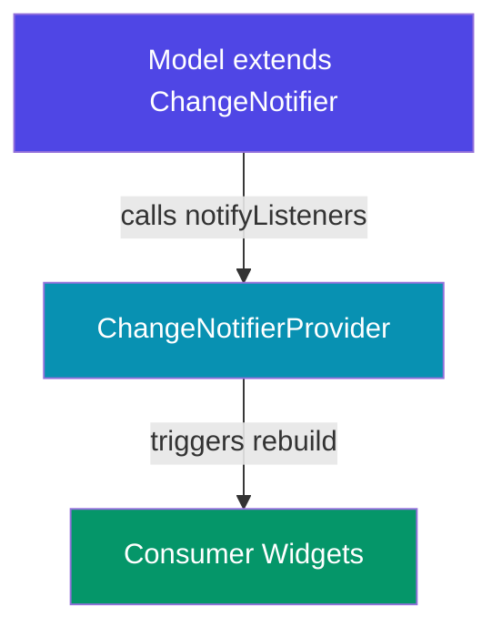

# ChangeNotifierProvider

In the `provider` package, `ChangeNotifierProvider` is the most common widget used to instantiate, expose, and manage mutable states that extend standard Dart `ChangeNotifier`.

---

## 1. Core Mechanics

`ChangeNotifierProvider` handles two main responsibilities:
1. **Creation and Disposal**: Instantiates a class extending `ChangeNotifier` and disposes of it automatically when the provider is removed from the widget tree.
2. **Rebuild Propagation**: Listens to notifications from the `ChangeNotifier` class and triggers a rebuild in all listening descendant widgets.



---

## 2. Code Example: Theme Changer

Here is a clean implementation of a theme mode state switcher using `ChangeNotifierProvider`.

### Step 1: Define the ChangeNotifier model
```dart
import 'package:flutter/material.dart';

class ThemeSettingsModel extends ChangeNotifier {
  ThemeMode _themeMode = ThemeMode.light;

  ThemeMode get themeMode => _themeMode;

  void toggleTheme() {
    _themeMode = _themeMode == ThemeMode.light ? ThemeMode.dark : ThemeMode.light;
    // Notify all listening elements to trigger a UI rebuild
    notifyListeners();
  }
}
```

### Step 2: Provide the model to the app tree
Wrap your root application structure inside `ChangeNotifierProvider`:

```dart
import 'package:flutter/material.dart';
import 'package:provider/provider.dart';

void main() {
  runApp(
    ChangeNotifierProvider(
      create: (context) => ThemeSettingsModel(),
      child: const MyApp(),
    ),
  );
}

class MyApp extends StatelessWidget {
  const MyApp({super.key});

  @override
  Widget build(BuildContext context) {
    // Read theme mode using watch to reactively update the MaterialApp theme
    final themeSettings = context.watch<ThemeSettingsModel>();

    return MaterialApp(
      themeMode: themeSettings.themeMode,
      theme: ThemeData.light(),
      darkTheme: ThemeData.dark(),
      home: const HomeScreen(),
    );
  }
}
```

### Step 3: Trigger state mutations
In descendents, access the toggle function without observing (using `read`):

```dart
class HomeScreen extends StatelessWidget {
  const HomeScreen({super.key});

  @override
  Widget build(BuildContext context) {
    return Scaffold(
      appBar: AppBar(title: const Text('Theme Switcher')),
      body: Center(
        child: ElevatedButton(
          onPressed: () {
            // Use read here so this button widget does not rebuild itself
            context.read<ThemeSettingsModel>().toggleTheme();
          },
          child: const Text('Toggle Theme'),
        ),
      ),
    );
  }
}
```

---

## 3. The `ChangeNotifierProvider.value` Constructor

By default, you should instantiate your change notifier using `create`. However, if you are providing an **already existing** instance (for example, passing an instance to a new screen or item in a list), use the `.value` named constructor:

```dart
// Use create when creating a new instance
ChangeNotifierProvider(
  create: (context) => MyModel(),
  child: ...
)

// Use .value when exposing an existing instance
ChangeNotifierProvider.value(
  value: alreadyExistingModel,
  child: ...
)
```
> [!WARNING]
> Never use `create` to pass an existing instance. This will lead to resource leaks and unexpected lifecycle bugs because Provider will attempt to dispose of it again.
